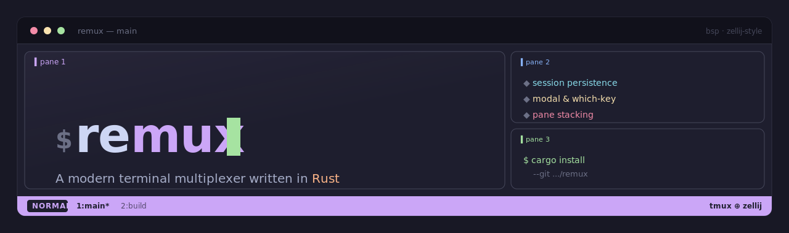

<p align="center">
  
</p>

[](https://github.com/rakanalh/remux/actions/workflows/ci.yml)

A modern terminal multiplexer written in Rust. Combines tmux's session persistence with zellij's visual pane borders, adds a modal keybinding system with which-key discoverability, and throws in pane stacking, multiple layout algorithms, a tree-view session manager, and first-class SSH remote sessions.

Built on a client-server architecture with Unix socket IPC, async I/O via tokio, VTE-based terminal parsing, and crossterm rendering with diff-based updates. Config changes hot-reload live — no restart needed.

---

## Features

### Sessions & persistence

- **Session persistence** — sessions live in a background server and survive client detach and disconnects. State auto-saves after every structural change and on shutdown when `save_sessions` is enabled.
- **Automatic restore** — with `automatic_restore = true` (the default), persisted sessions come back live when the server starts.
- **Dormant "resurrect" sessions** — with `save_sessions = true` and `automatic_restore = false`, saved sessions load as dormant entries instead of coming live. They appear in the session manager and are materialized on demand when you switch to one.
- **Folder organization** — group sessions into named folders in the session tree for tidy management.
- **Session switcher** — a quick switcher (`Alt-s`) that aggregates local **and** remote sessions into one list so you can jump anywhere without opening the full manager.
- **Last session toggle** — `Alt-o` (or `Ctrl-a x o`) flips back to the previously-attached session, like tmux's last-session.
- **Session manager** — a tree-view overlay for browsing, creating, deleting, renaming, moving, and switching sessions, folders, tabs, and panes — across both local and remote servers.

### Panes & layouts

- **Splitting & focus** — split panes vertically or horizontally, and move focus directionally. Directional focus is **stack-aware**: it steps through stacked panes at a position before crossing to the neighbouring split.
- **Move (swap) panes** — `PaneMove*` swaps the focused pane with its directional neighbour to rearrange a layout without re-splitting.
- **Pane stacking** — multiple panes can occupy the same screen position and cycle like tabs within a split (`stack add`, `stack next/prev`).
- **Zoom** — toggle a focused pane to fullscreen and back, keeping the rest of the layout intact.
- **Resize** — grow/shrink the focused pane edge by a configurable amount.
- **Four layout algorithms** — **BSP** (recursive binary space partitioning, the default), **Master** (one large pane + evenly divided secondaries), **Monocle** (one pane fullscreen, cycle with stack next/prev), and **Custom** (your exact manual splits, no auto-redistribution). Cycle with `Alt-Space` / `Ctrl-a Space`.
- **Login-shell panes** — new panes spawn their shell as a login shell so your profile/rc files run as expected.
- **Two rendering styles** — **Zellij style** (rounded box borders with pane names) and **Tmux style** (minimal dividers). Toggle live with `Ctrl-a g`.

### Tabs & activity monitoring

- **Tabs** — each session holds multiple tabs; create, close, rename, reorder, and jump to tabs by index.
- **Background activity monitoring** — non-active tabs surface a marker in the tab bar so you know what changed while you were elsewhere:
  - `!` (red) — a **bell** fired in the tab.
  - `●` (yellow) — new **output/activity** appeared.
  - `✓` (green) — a previously-busy tab went **silent/finished**.

### Modal input & which-key

- **Modal input** — Normal, Command, Visual, and Search modes. In **Normal** mode keys pass straight through to the running application.
- **Leader key** — the leader (`Ctrl-a` by default) enters **Command** mode, which drives a tree of keybindings.
- **Which-key popup** — after the leader, a popup lists the available keys at the current tree level (and the global Alt shortcuts, emacs-style). Appearance delay is configurable via `timeout_ms`.
- **Configurable which-key position** — `anchored` (bordered box centered horizontally, anchored bottom), `centered` (bordered box, both axes), or `full_width` (a bordered ivy/emacs-style panel spanning the terminal width above the status bar).
- **Instant Alt shortcuts** — a set of `Alt-…` shortcuts act immediately in Normal mode without pressing the leader first.
- **Command palette** — `Ctrl-a :` opens a searchable list of every command.

### Visual / copy mode & search

- **Visual (copy) mode** — vim-style scrollback navigation with `h/j/k/l` cursor movement, `Ctrl-d`/`Ctrl-u` half-page scroll, `gg`/`G` to jump, character-wise (`v` or `Space`) and line-wise (`V`) selection, and `y` to yank the selection to the system clipboard (via OSC 52).
- **Search** — `/` from Visual mode (or the Search leader binding) searches scrollback with highlighted matches; navigate with `n` (previous) / `N` (next), landing back in Visual mode on a match.
- **External editor** — open a pane's full scrollback in `$EDITOR` for review, copy, or piping.

### Remote sessions (SSH)

- **Remote attach over SSH** — declare servers in `[remotes.<name>]` (or connect ad-hoc with `RemoteConnect user@host`). Each remote is a top-level node in the session manager tree.
- **Unified lazy tree** — expanding a remote node lazily connects over SSH (spawning `remux relay` on the remote) and lists that server's sessions, merged into the same tree as local sessions.
- **Foreground handoff** — attaching to a remote session hands the render loop over to the remote transport, so remote sessions feel just like local ones. Structural edits (create/delete/rename/move) stay local-only; remotes support expand and switch-to-session/tab/pane.

### Mouse

- **Text selection** — click-drag to select; on release the selection auto-copies to the clipboard and clears (`mouse_auto_yank`, on by default). Disable it to keep the selection for keyboard adjustment in Visual mode.
- **Click to switch** — click tabs and stacked panes to switch to them.
- **Wheel forwarding** — the mouse wheel is forwarded to applications that request mouse tracking or use the alternate screen (e.g. `less`, `vim`); otherwise it scrolls Remux's own scrollback.

### Theming & configuration

- **Configurable theming** — named colors, CSS hex, ANSI 256 indices, and RGB tuples. Per-mode status bar colors, frame colors, tab colors, which-key colors, search-highlight colors, and more (defaults are Catppuccin Mocha).
- **Hot-reload** — a file watcher reloads `~/.config/remux/config.toml` on save and the client applies new **keybindings, theme, and remotes** live.
- **Fully configurable keybindings** — override or unbind any leader-tree key or Alt shortcut, remap the leader, and chain commands. See [Keybindings](#keybindings) and [Chaining commands](#chaining-commands).

## Which-key

After pressing the leader key, a popup shows the available keybindings at each tree level, plus the global Alt shortcuts. The delay before it appears is configurable (`timeout_ms`).


## Command palette

`Ctrl-a :` opens a searchable list of all available commands.


## Session manager

Tree-view overlay for browsing, creating, deleting, renaming, moving, and switching sessions, folders, tabs, and panes — local and remote.


## Layouts

### BSP (Binary Space Partitioning)

Recursively splits screen space, alternating horizontal and vertical. Each new pane takes 50% of the focused area. Produces a balanced, compact distribution. This is the default.


### Master

One master pane occupies 50% of the screen; secondary panes divide the remaining space evenly. Ideal for a primary editor with supporting terminals. Use `SetMaster` to promote the focused pane.


### Monocle

Full-screen single pane — only the active pane is visible. Cycle through panes with stack next/prev.


### Custom

Manual splits created by you. No automatic redistribution — your exact arrangement is preserved.

## Install / build / run

### Install with cargo

```bash
cargo install --git https://github.com/rakanalh/remux
```

This builds and installs the `remux` binary into `~/.cargo/bin` (make sure it's on your `PATH`).

### Build from source

```bash
cargo build --release
```

Requires a Unix/Linux system (uses POSIX PTY).

### CLI usage

```
remux                                          # Attach to "main" (creating it if needed)
remux new --session <name> [--folder <dir>]    # Create a session
remux attach <name>                            # Attach to a session
remux ls                                       # List sessions
remux kill <name>                              # Kill a session
```

### Configuration file

Remux reads `~/.config/remux/config.toml`. A complete, fully-commented reference lives in [`config.sample.toml`](config.sample.toml) — every option is shown commented-out at its default value, so copying it verbatim reproduces the built-in defaults:

```bash
mkdir -p ~/.config/remux
cp config.sample.toml ~/.config/remux/config.toml
```

Edits are picked up automatically by the file watcher — no restart needed.

## Keybindings

Remux is modal:

- **Normal mode** passes every key straight through to the running application, *except* the leader key and the configured Alt shortcuts.
- The **leader key** (`Ctrl-a` by default) enters **Command mode** and opens the which-key popup showing the keybinding tree.
- **Alt shortcuts** act **instantly in Normal mode** — no leader press required.

Both the leader tree and the Alt shortcuts are fully configurable and **hot-reload live**. The which-key popup lists both the current tree level and the global Alt shortcuts.

### Leader tree (default, leader = `Ctrl-a`)

Press the leader, then walk the tree. Bindings marked *(→ Normal)* return you to Normal mode after running; the rest leave you in Command mode for chaining.

#### Root

| Key | Action |
|-----|--------|
| `p` | Open the **Pane** group |
| `t` | Open the **Tab** group |
| `x` | Open the **Session** group |
| `s` | Open the **Search** group |
| `v` | Enter Visual mode |
| `g` | Toggle border style (Zellij ⇄ Tmux) *(→ Normal)* |
| `Space` | Cycle layout (BSP → Master → Monocle) *(→ Normal)* |
| `f` | Zoom the focused pane *(→ Normal)* |
| `}` | Next tab *(→ Normal)* |
| `{` | Previous tab *(→ Normal)* |
| `:` | Open the command palette |
| `a` | Send the literal prefix key (`Ctrl-a`) to the app *(→ Normal)* |

#### Pane (`p`)

| Key | Action |
|-----|--------|
| `n` | New pane *(→ Normal)* |
| `x` | Close pane *(→ Normal)* |
| `v` | Split vertical *(→ Normal)* |
| `s` | Split horizontal *(→ Normal)* |
| `h` / `j` / `k` / `l` | Focus left / down / up / right *(→ Normal)* |
| `H` / `J` / `K` / `L` | Move (swap) pane left / down / up / right *(→ Normal)* |
| `z` | Toggle zoom *(→ Normal)* |
| `r` | Rename pane |
| `a` | Add pane to stack *(→ Normal)* |
| `]` | Next pane in stack *(→ Normal)* |
| `[` | Previous pane in stack *(→ Normal)* |
| `R` | Open the **Resize** sub-group |

#### Pane → Resize (`p R`)

| Key | Action |
|-----|--------|
| `h` / `j` / `k` / `l` | Resize left / down / up / right by 5 |

#### Tab (`t`)

| Key | Action |
|-----|--------|
| `n` | New tab *(→ Normal)* |
| `x` | Close tab *(→ Normal)* |
| `r` | Rename tab |
| `]` / `[` | Next / previous tab *(→ Normal)* |
| `m` | Move tab |
| `1`–`9` | Jump to tab 1–9 *(→ Normal)* |

#### Session (`x`)

| Key | Action |
|-----|--------|
| `s` | Quick session switcher |
| `o` | Last session (toggle) |
| `n` | New session |
| `r` | Rename session |
| `d` | Detach |
| `m` | Open session manager |
| `f` | Move session to folder |

#### Search (`s`)

| Key | Action |
|-----|--------|
| `s` | Enter search mode |
| `e` | Open scrollback in `$EDITOR` |

### Alt shortcuts (default, instant in Normal mode)

| Shortcut | Action |
|----------|--------|
| `Alt-h` / `Alt-j` / `Alt-k` / `Alt-l` | Focus pane left / down / up / right |
| `Alt-H` / `Alt-J` / `Alt-K` / `Alt-L` | Move (swap) pane left / down / up / right |
| `Alt-,` / `Alt-.` | Previous / next tab |
| `Alt-1` … `Alt-9` | Jump to tab 1–9 |
| `Alt-t` | New tab |
| `Alt-s` | Quick session switcher (local + remote) |
| `Alt-o` | Last session (toggle) |
| `Alt-z` | Toggle pane zoom |
| `Alt-Space` | Cycle layout |

### Visual mode

Entered with `v` in Command mode. Vim-style scrollback navigation and selection.

| Key | Action |
|-----|--------|
| `h` / `j` / `k` / `l` | Move cursor left / down / up / right |
| `Ctrl-d` / `Ctrl-u` | Half-page down / up |
| `gg` / `G` | Jump to top / bottom |
| `v` or `Space` | Start/toggle character-wise selection |
| `V` | Start/toggle line-wise selection |
| `y` | Yank selection to clipboard |
| `/` | Search scrollback |
| `e` | Open scrollback in `$EDITOR` |
| `Esc` | Return to Normal |

### Search mode

Entered with `/` in Visual mode (or the Search leader binding).

| Key | Action |
|-----|--------|
| _text_ | Type the query |
| `Enter` | Confirm search |
| `n` / `N` | Previous / next match |
| `Esc` | Cancel and clear highlights |

### Session manager

Opened with `Ctrl-a x m` (or `Alt-s` for the quick switcher).

| Key | Action |
|-----|--------|
| `Up` / `Down` | Navigate the tree |
| `Enter` | Switch to node (or expand it) |
| `l` / `Right` / `+` | Expand (including connecting a remote) |
| `h` / `Left` / `-` | Collapse |
| `}` / `{` | Switch tab within the highlighted session |
| `n` | New session |
| `c` | New folder |
| `d` | Delete session |
| `m` | Move session |
| `Esc` | Close |

## Commands

Every command below is a `RemuxCommand` recognised by the config parser and the command palette. Commands are written in PascalCase; arguments are space-separated (quote any argument containing spaces, e.g. `SessionNew "my project"`).

| Command | Arguments | Description |
|---------|-----------|-------------|
| `TabNew` | — | Create a new tab. |
| `TabClose` | — | Close the active tab. |
| `TabRename` | `<name>` | Rename the active tab. |
| `TabGoto` | `<index>` | Jump to the tab at the given 0-based index. |
| `TabNext` | — | Focus the next tab. |
| `TabPrev` | — | Focus the previous tab. |
| `TabMove` | `<index>` | Move the active tab to the given position (default 0). |
| `PaneNew` | — | Open a new pane in the current tab. |
| `PaneClose` | — | Close the focused pane. |
| `PaneSplitVertical` | — | Split the focused pane vertically. |
| `PaneSplitHorizontal` | — | Split the focused pane horizontally. |
| `PaneFocusLeft` | — | Move focus to the pane on the left (stack-aware). |
| `PaneFocusRight` | — | Move focus to the pane on the right (stack-aware). |
| `PaneFocusUp` | — | Move focus to the pane above (stack-aware). |
| `PaneFocusDown` | — | Move focus to the pane below (stack-aware). |
| `PaneStackAdd` | — | Add the focused pane to a stack at its position. |
| `PaneStackNext` | — | Cycle to the next pane in the current stack. |
| `PaneStackPrev` | — | Cycle to the previous pane in the current stack. |
| `PaneMoveLeft` | — | Swap the focused pane with its left neighbour. |
| `PaneMoveRight` | — | Swap the focused pane with its right neighbour. |
| `PaneMoveUp` | — | Swap the focused pane with the pane above. |
| `PaneMoveDown` | — | Swap the focused pane with the pane below. |
| `PaneRename` | `<name>` | Rename the focused pane. |
| `PaneToggleZoom` | — | Toggle fullscreen zoom for the focused pane. |
| `ResizeLeft` | `<amount>` | Resize the focused pane's left edge (default 1). |
| `ResizeRight` | `<amount>` | Resize the focused pane's right edge (default 1). |
| `ResizeUp` | `<amount>` | Resize the focused pane's top edge (default 1). |
| `ResizeDown` | `<amount>` | Resize the focused pane's bottom edge (default 1). |
| `SessionNew` | `<name> [folder]` | Create a new session, optionally inside a folder. |
| `SessionDetach` | — | Detach the client from the current session. |
| `SessionRename` | `<name>` | Rename the current session. |
| `SessionList` | — | List active sessions. |
| `SessionSave` | — | Persist session state to disk immediately. |
| `FolderNew` | `<name>` | Create a new folder. |
| `FolderDelete` | `<name>` | Delete a folder. |
| `FolderList` | — | List folders. |
| `FolderMoveSession` | `<session> [folder]` | Move a session into a folder (omit folder to unfile it). |
| `BufferEditInEditor` | — | Open the focused pane's scrollback in `$EDITOR`. |
| `OpenSessionManager` | — | Open the tree-view session manager overlay. |
| `RemoteConnect` | `<user@host\|alias>` | Connect to a remote server over SSH — an SSH destination/`~/.ssh/config` host, or a `[remotes.<name>]` alias. |
| `SessionMoveToFolder` | — | Open a folder picker to move the current session. |
| `SessionSwitchLast` | — | Toggle back to the previously-attached session. |
| `ToggleStyle` | — | Toggle border rendering between Zellij and Tmux styles. |
| `LayoutNext` | — | Cycle the layout mode (BSP → Master → Monocle). |
| `SetMaster` | — | Make the focused pane the master pane (Master layout). |
| `EnterNormal` | — | Return to Normal mode (keys pass to the app). |
| `EnterCommandMode` | — | Enter Command mode (navigate the leader tree). |
| `EnterVisualMode` | — | Enter Visual/copy mode. |

> A few binding-only actions are handled directly by the client and so aren't in the palette list above: `EnterSearchMode`, `SendKey <key-notation>`, `SessionQuickSwitch`, and `CommandPaletteOpen`.

## Chaining commands

A keybinding value can run **multiple commands in sequence** by separating them with semicolons. This works for both leader-tree leaves and Alt shortcuts:

```toml
[keybindings.command]
"Alt-x" = "PaneNew; PaneFocusRight"     # create a pane, then focus right

[keybindings.command.p]
n = "PaneNew; EnterNormal"              # create a pane and drop back to Normal
```

If a chain includes `EnterNormal`, you return to Normal mode after it runs; otherwise you stay in Command mode for further keys. This is why most default tree leaves end in `; EnterNormal` — the action fires and control returns to the application.

### Group-prefix shortcuts (`@group`)

An Alt shortcut value can be a `@`-prefixed **group path** instead of a command chain. It opens that leader-tree group directly (showing its which-key level) without pressing the leader first:

```toml
[keybindings.command]
"Alt-p" = "@p"      # jump straight into the Pane group
"Alt-t" = "@t"      # jump straight into the Tab group
```

### Overriding and unbinding

User bindings **merge on top of** the defaults — you only redefine the keys you want to change. Set a binding to an empty string to remove it:

```toml
[keybindings.command]
leader = "Ctrl-b"   # remap the leader key
"Alt-h" = ""        # remove a default Alt shortcut

[keybindings.command.v]
# (root-level leader keys go directly under [keybindings.command])
```

## Configuration

The full, commented reference is [`config.sample.toml`](config.sample.toml). Highlights:

- **`[general]`**
  - `default_shell` — override `$SHELL` for new panes.
  - `scrollback_lines` — lines kept per pane (default 10000).
  - `save_sessions` — persist session state to disk (default `true`). When `false`, nothing is written and `automatic_restore` is ignored.
  - `automatic_restore` — restore persisted sessions live on startup (default `true`). With `save_sessions = true` and this `false`, saved sessions load as **dormant/resurrectable** entries in the session manager instead.
  - `mouse_auto_yank` — auto-copy mouse selections on release (default `true`).
- **`[appearance]`**
  - `status_bar_position` — `"top"` or `"bottom"`.
  - `border_style` — `"zellij_style"` or `"tmux_style"`.
  - `default_layout` — `"bsp"`, `"master"`, `"monocle"`, or `"custom"`.
  - `which_key_position` — `"anchored"`, `"centered"`, or `"full_width"`.
  - `[appearance.theme]` — per-role colors (named / hex / `{ ansi = N }` / `{ rgb = [r,g,b] }`); defaults are Catppuccin Mocha.
- **`[modes.command]`**
  - `timeout_ms` — delay before the which-key popup appears (default 500).
- **`[remotes.<name>]`** — declare SSH-reachable remote servers:

```toml
[remotes.pi]
ssh = "pi@raspberrypi.local"
remux_path = "/usr/local/bin/remux"

[remotes.server]
ssh = "user@example.com"
port = 2222
identity = "~/.ssh/id_ed25519"
extra_args = ["-o", "StrictHostKeyChecking=no"]
```

### Theming example

Colors accept named strings, CSS hex, ANSI 256 indices, or RGB tuples:

```toml
[appearance.theme]
mode_normal_fg = "#1e1e2e"
mode_normal_bg = "#a6e3a1"
frame_active_fg = { ansi = 2 }
status_bar_bg = { rgb = [40, 40, 40] }
session_name_fg = "#94e2d5"
```

## License

MIT — see [LICENSE](LICENSE).

---

This project was written by [Claude](https://claude.ai) (Anthropic) with my specs and guidance. This is an AI-coded product. Issues and pull requests will not be actively monitored or reviewed.
