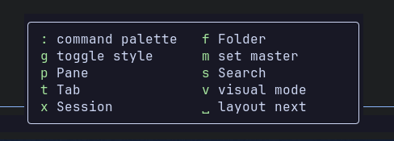
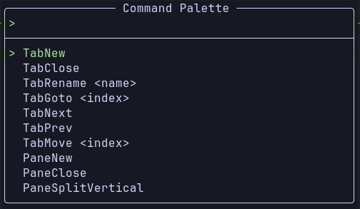
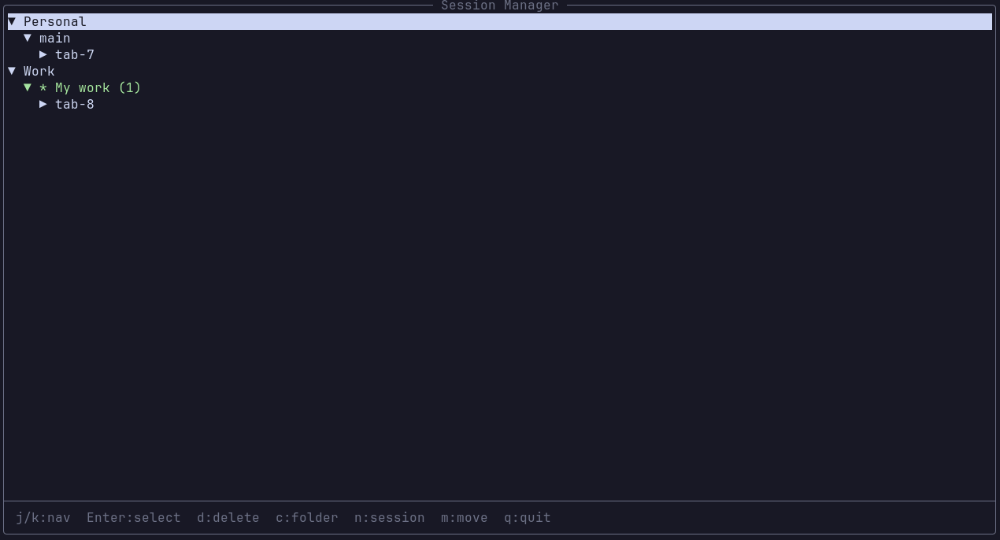
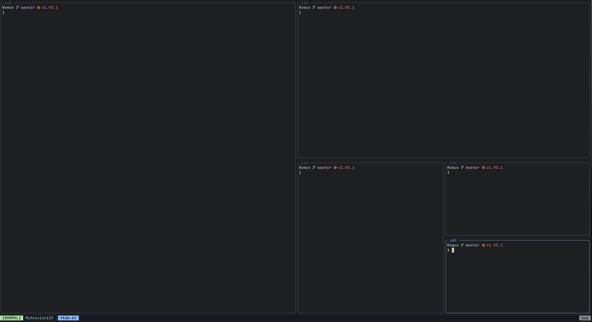
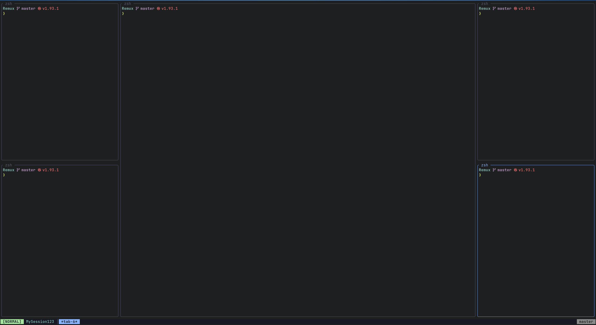
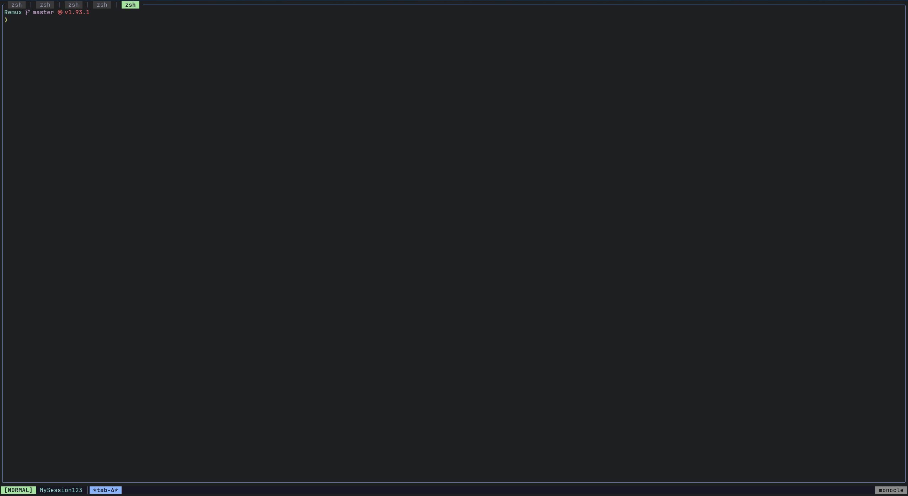

<pre>
 ____  _____ __  __ _   ___  __
|  _ \| ____|  \/  | | | \ \/ /
| |_) |  _| | |\/| | | | |\  /
|  _ <| |___| |  | | |_| |/  \
|_| \_\_____|_|  |_|\___//_/\_\
</pre>

A modern terminal multiplexer written in Rust. Combines tmux's session persistence with zellij's visual pane borders, adds a modal keybinding system with which-key discoverability, and throws in pane stacking, multiple layout algorithms, and a tree-view session manager.

Built on a client-server architecture with Unix socket IPC, async I/O via tokio, VTE-based terminal parsing, and crossterm rendering with diff-based updates.

## Features

- **Session persistence** -- sessions survive detach and server restarts. State auto-saves after structural changes and restores on startup.
- **Folder organization** -- group sessions into named folders for better management.
- **Modal input** -- Normal, Command, Visual, and Search modes. Keys pass through to the terminal in Normal mode; leader key enters Command mode.
- **Pane stacking** -- multiple panes can occupy the same screen position and cycle through like tabs within a split.
- **Four layout algorithms** -- BSP, Master, Monocle, and Custom. Cycle with `Space` in Command mode.
- **Two rendering styles** -- Zellij style (rounded box borders with pane names) and Tmux style (minimal dividers). Toggle with `g`.
- **Visual mode** -- vim-style scrollback navigation with character-wise and line-wise selection, search, and yank to clipboard.
- **Search mode** -- `/` in Visual mode to search scrollback with highlighted matches and `n`/`N` navigation.
- **Mouse support** -- click-to-select text, auto-copy on release, click tabs/stacks to switch.
- **External editor** -- open full scrollback in `$EDITOR` for review.
- **Session manager** -- tree-view overlay for browsing, creating, deleting, and switching sessions/folders.
- **Configurable theming** -- named colors, ANSI 256, and RGB. Per-mode status bar colors, frame colors, and more.
- **Hot-reload config** -- file watcher reloads `~/.config/remux/config.toml` on save.
## Which-key

After pressing the leader key, a popup shows available keybindings at each tree level. Timeout is configurable.



## Command Palette

`:` in Command mode opens a searchable list of all available commands.



## Session Manager

Tree-view overlay for browsing, creating, deleting, and switching sessions and folders.



## Layouts

### BSP (Binary Space Partitioning)

Recursively splits screen space, alternating horizontal and vertical. Each new pane takes 50% of the focused area. Produces a balanced, compact distribution. This is the default.



### Master

One master pane occupies 50% of the screen. Secondary panes are divided evenly in the remaining space. Ideal for a primary editor with supporting terminals.



### Monocle

Full-screen single pane. Only the active pane is visible. Cycle through panes with stack next/prev.



### Custom

Manual splits created by the user. No automatic redistribution. Preserves your exact arrangement. Activated when you perform manual split operations.

## Keybindings

### Normal Mode

All keys pass through to the active terminal, except:

| Key | Action |
|-----|--------|
| `Ctrl-a` | Enter Command mode (leader key) |
| `Ctrl-a Ctrl-a` | Send literal `Ctrl-a` to terminal |
| `Alt-h/j/k/l` | Focus pane left/down/up/right |
| `Alt-n` | Next tab |
| `Alt-p` | Open Pane group (which-key) |
| `Alt-t` | Open Tab group (which-key) |

### Command Mode

Entered via leader key (`Ctrl-a`). Press `Escape` to return to Normal.

#### Tab (`t`)

| Key | Action |
|-----|--------|
| `t n` | New tab |
| `t c` | Close tab |
| `t m` | Move tab |
| `t r` | Rename tab |
| `t l` | Next tab |

#### Pane (`p`)

| Key | Action |
|-----|--------|
| `p n` | New pane |
| `p c` | Close pane |
| `p s` | Split vertical |
| `p S` | Split horizontal |
| `p h/j/k/l` | Focus left/down/up/right |
| `p a` | Add pane to stack |
| `p ]` | Next pane in stack |
| `p [` | Previous pane in stack |
| `p R` | Rename pane |

#### Pane Resize (`p r`)

| Key | Action |
|-----|--------|
| `p r h` | Resize left |
| `p r j` | Resize down |
| `p r k` | Resize up |
| `p r l` | Resize right |

#### Search (`s`)

| Key | Action |
|-----|--------|
| `s s` | Enter search mode |
| `s e` | Open scrollback in editor |

#### Session (`x`)

| Key | Action |
|-----|--------|
| `x n` | New session |
| `x d` | Detach |
| `x r` | Rename session |
| `x l` | Session list |

#### Folder (`f`)

| Key | Action |
|-----|--------|
| `f n` | New folder |
| `f d` | Delete folder |
| `f l` | List folders |
| `f m` | Move session to folder |

#### Root-level

| Key | Action |
|-----|--------|
| `v` | Enter Visual mode |
| `g` | Toggle rendering style (Zellij/Tmux) |
| `Space` | Cycle layout (BSP -> Master -> Monocle) |
| `m` | Set focused pane as master |
| `:` | Open command palette |

### Visual Mode

Entered via `v` in Command mode. Vim-style scrollback navigation.

| Key | Action |
|-----|--------|
| `j` / `k` | Scroll down/up |
| `Ctrl-d` / `Ctrl-u` | Half-page down/up |
| `gg` | Jump to top |
| `G` | Jump to bottom |
| `h` / `l` | Move cursor left/right |
| `v` | Toggle character selection |
| `V` | Toggle line selection |
| `y` | Yank selection to clipboard |
| `/` | Enter search mode |
| `e` | Open scrollback in `$EDITOR` |
| `Escape` | Return to Normal |

### Search Mode

Entered via `/` in Visual mode.

| Key | Action |
|-----|--------|
| _text_ | Type search query |
| `Enter` | Confirm search |
| `n` | Next match |
| `N` | Previous match |
| `Escape` | Cancel search |

### Session Manager

Opened via `x l` or `Alt-s`.

| Key | Action |
|-----|--------|
| `Up` / `Down` | Navigate tree |
| `Enter` | Switch session / expand folder |
| `Left` / `Right` | Collapse / expand |
| `n` | New session |
| `c` | New folder |
| `d` | Delete session |
| `m` | Move session |
| `Escape` | Close |

## Action Chains

Keybindings support chaining multiple commands with semicolons:

```toml
n = "TabNew; EnterNormal"          # Create tab, return to Normal
n = "PaneNew; ResizeRight 10"      # Create pane, resize, stay in Command
```

If the chain includes `EnterNormal`, you return to Normal mode after execution. Otherwise you stay in Command mode.

## Configuration

Remux uses a TOML config file. To set it up:

```bash
mkdir -p ~/.config/remux
cp config.sample.toml ~/.config/remux/config.toml
```

Edit `~/.config/remux/config.toml` to customize. Changes are picked up automatically via file watcher -- no restart needed.

```toml
[general]
scrollback_lines = 10000
automatic_restore = true
mouse_auto_yank = true

[appearance]
status_bar_position = "bottom"     # "top" or "bottom"
border_style = "zellij_style"      # "zellij_style" or "tmux_style"

[modes.command]
timeout_ms = 500                   # Which-key popup delay

# Leader key
leader = "Ctrl-a"

# Modifier shortcuts (Normal mode, bypass leader)
"Alt-h" = "PaneFocusLeft"
"Alt-j" = "PaneFocusDown"
"Alt-k" = "PaneFocusUp"
"Alt-l" = "PaneFocusRight"
"Alt-n" = "TabNext"
"Alt-p" = "@p"                     # Open Pane which-key group
"Alt-t" = "@t"                     # Open Tab which-key group

# Keybinding groups
[keybindings.command.t]
_label = "Tab"
n = "TabNew; EnterNormal"
c = "TabClose; EnterNormal"
```

### Theming

Colors accept named strings, ANSI 256 indices, RGB tuples, or hex strings:

```toml
[appearance.theme]
mode_normal_fg = "black"
mode_normal_bg = "bright_green"
frame_active_fg = { ansi = 2 }
status_bar_bg = { rgb = [40, 40, 40] }
session_name_fg = "#CBA6F7"
```

## CLI Usage

```
remux new --session <name> [--folder <dir>]   # Create session
remux attach <name>                            # Attach to session
remux ls                                       # List sessions
remux kill <name>                              # Kill session
remux                                          # Attach to "main" or create it
```

## Building

```
cargo build --release
```

Requires a Unix/Linux system (uses POSIX PTY).

## License

MIT -- see [LICENSE](LICENSE).

---

This project was written by [Claude](https://claude.ai) (Anthropic) with my specs and guidance. This is an AI-coded product. Issues and pull requests will not be actively monitored or reviewed.
