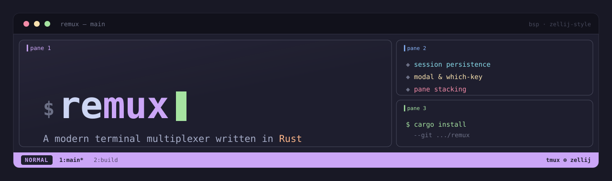
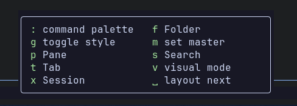
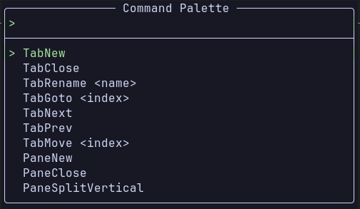
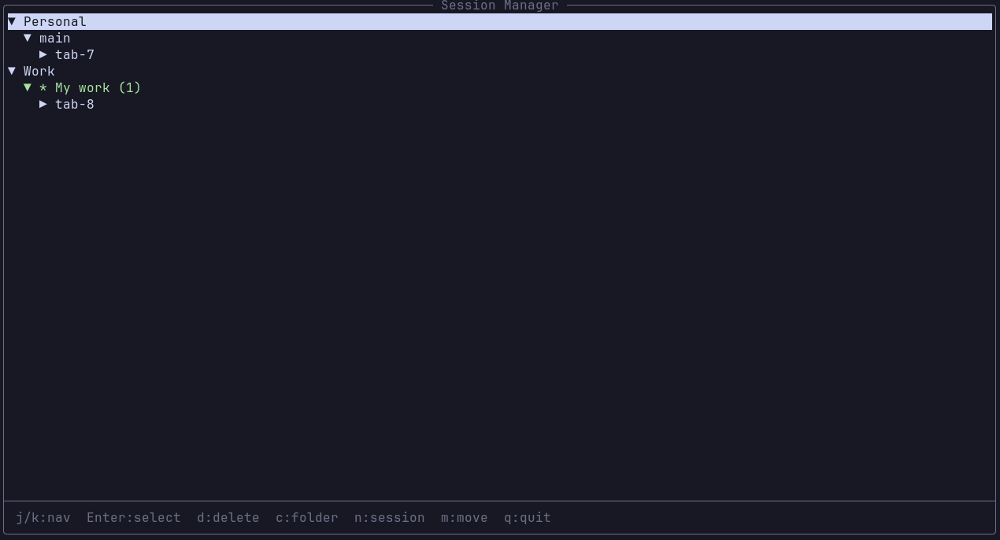
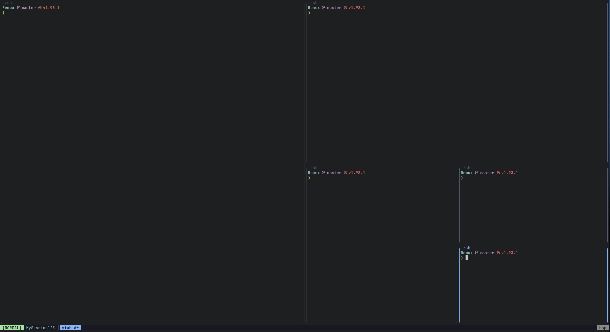
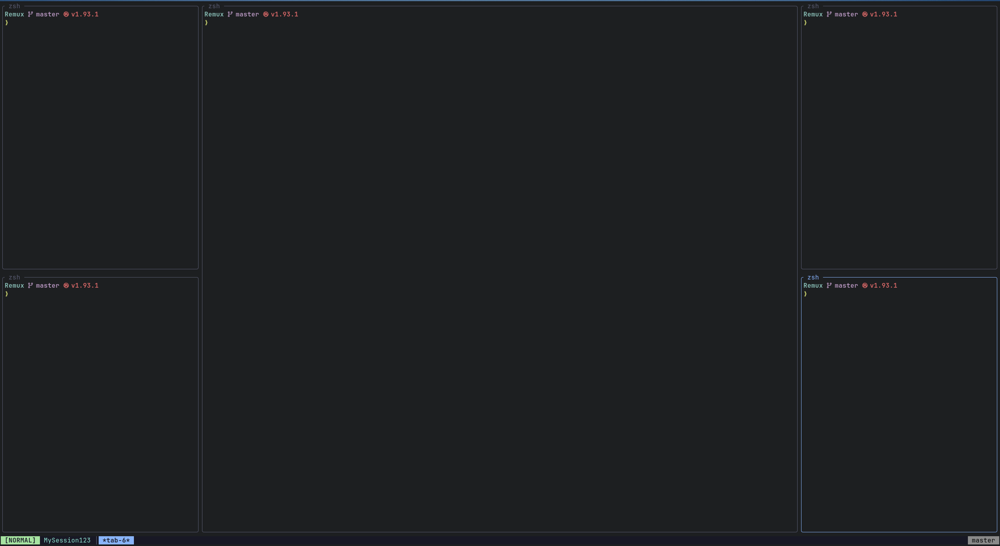
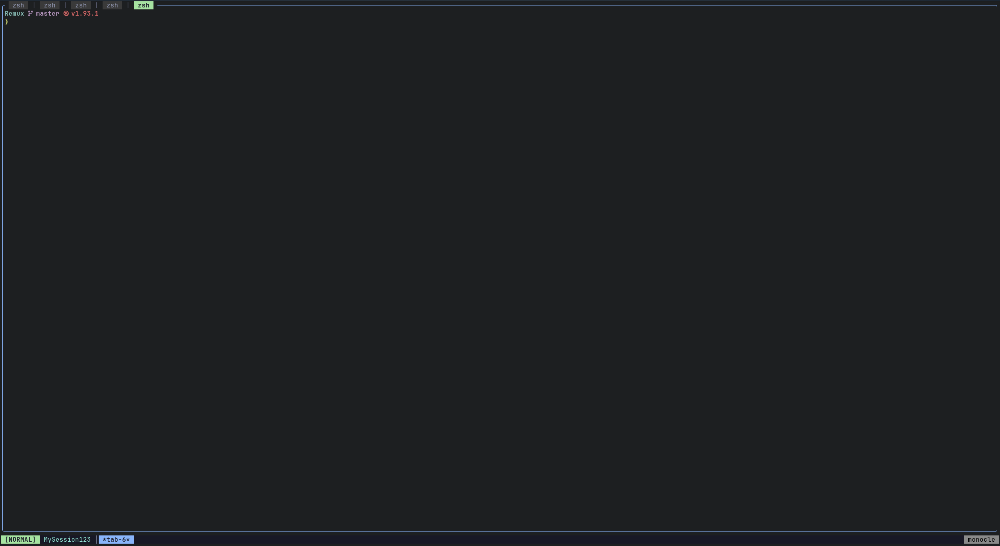

<p align="center">
  
</p>

[](https://github.com/rakanalh/remux/actions/workflows/ci.yml)

A modern terminal multiplexer written in Rust. Combines tmux's session persistence with zellij's visual pane borders, adds a modal keybinding system with which-key discoverability, and throws in pane stacking, multiple layout algorithms, a tree-view session manager, first-class SSH remote sessions, and **Views** — a single screen composed of live panes borrowed from any session on any machine.

Built on a client-server architecture with Unix socket IPC, async I/O via tokio, VTE-based terminal parsing, and crossterm rendering with diff-based updates. Keybindings, theme, and remotes hot-reload on save; the server-side `[agents]` section is read at startup and needs `remux restart`.

---

## Features

### Sessions & persistence

- **Session persistence** — sessions live in a background server and survive client detach and disconnects. State auto-saves after every structural change and on shutdown when `save_sessions` is enabled.
- **Automatic restore** — with `automatic_restore = true` (the default), persisted sessions come back live when the server starts.
- **Dormant "resurrect" sessions** — with `save_sessions = true` and `automatic_restore = false`, saved sessions load as dormant entries instead of coming live. They appear in the session manager and are materialized on demand when you switch to one.
- **Folder organization** — group sessions into named folders in the session tree for tidy management.
- **Session switcher** — a quick switcher (`Alt-s`) that aggregates local **and** remote sessions into one list so you can jump anywhere without opening the full manager.
- **Last session toggle** — `Alt-o` (or `Ctrl-a x o`) flips back to the previously-attached session, like tmux's last-session.
- **Session manager** — a tree-view overlay for browsing, creating, deleting, renaming, moving, and switching sessions, folders, tabs, and panes — across both local and remote servers.

### Panes & layouts

- **Splitting & focus** — split panes vertically or horizontally, and move focus directionally. Directional focus is **stack-aware**: it steps through stacked panes at a position before crossing to the neighbouring split.
- **Move (swap) panes** — `PaneMove*` swaps the focused pane with its directional neighbour to rearrange a layout without re-splitting.
- **Pane stacking** — multiple panes can occupy the same screen position and cycle like tabs within a split (`stack add`, `stack next/prev`).
- **Zoom** — toggle a focused pane to fullscreen and back, keeping the rest of the layout intact.
- **Resize** — grow/shrink the focused pane edge by a configurable amount.
- **Five layout algorithms** — **BSP** (recursive binary space partitioning, the default), **Master** (one large pane + evenly divided secondaries), **Monocle** (one pane fullscreen, cycle with stack next/prev), **Grid** (equal-size cells, `ceil(sqrt(n))` columns — the default for Views), and **Custom** (your exact manual splits, no auto-redistribution). Cycle the automatic ones with `Alt-Space` / `Ctrl-a Space` (BSP → Master → Monocle → Grid).
- **Popup terminal** — a scratch terminal that floats centered on top of the layout instead of occupying a slot in it. Toggle with `Alt-p` (or `Ctrl-a p o`); it keeps running while hidden, so it's the same terminal with the same history every time you pull it up. One per session — toggle it from any tab and it follows you. Sized as a percentage of the screen (`popup_width_pct` / `popup_height_pct`, default 80×80) and resizable while open with the pane-resize keys. It takes no space from the surrounding panes and is excluded from every layout operation, so `Alt-Space`, zoom, and pane move/swap can never pull it into the layout.
- **Login-shell panes** — new panes spawn their shell as a login shell so your profile/rc files run as expected.
- **Two rendering styles** — **Zellij style** (rounded box borders with pane names) and **Tmux style** (minimal dividers). Toggle live with `Ctrl-a g`.

### Tabs & activity monitoring

- **Tabs** — each session holds multiple tabs; create, close, rename, reorder, and jump to tabs by index.
- **Background activity monitoring** — non-active tabs surface a marker in the tab bar so you know what changed while you were elsewhere:
  - `!` (red) — a **bell** fired in the tab.
  - `●` (yellow) — new **output/activity** appeared.
  - `✓` (green) — a previously-busy tab went **silent/finished**.

### Modal input & which-key

- **Modal input** — Normal, Command, Visual, and Search modes. In **Normal** mode keys pass straight through to the running application.
- **Leader key** — the leader (`Ctrl-a` by default) enters **Command** mode, which drives a tree of keybindings.
- **Which-key popup** — after the leader, a popup lists the available keys at the current tree level (and the global Alt shortcuts, emacs-style). Appearance delay is configurable via `timeout_ms`.
- **Configurable which-key position** — `anchored` (bordered box centered horizontally, anchored bottom), `centered` (bordered box, both axes), or `full_width` (a bordered ivy/emacs-style panel spanning the terminal width above the status bar).
- **Instant Alt shortcuts** — a set of `Alt-…` shortcuts act immediately in Normal mode without pressing the leader first.
- **Command palette** — `Ctrl-a :` opens a searchable list of every command.

### Visual / copy mode & search

- **Visual (copy) mode** — vim-style scrollback navigation with `h/j/k/l` cursor movement, `Ctrl-d`/`Ctrl-u` half-page scroll, `gg`/`G` to jump, character-wise (`v` or `Space`) and line-wise (`V`) selection, and `y` to yank the selection to the system clipboard (via OSC 52).
- **Search** — `/` from Visual mode (or the Search leader binding) searches scrollback with highlighted matches; navigate with `n` (previous) / `N` (next), landing back in Visual mode on a match.
- **External editor** — open a pane's full scrollback in `$EDITOR` for review, copy, or piping.

### Remote sessions (SSH)

- **Remote attach over SSH** — declare servers in `[remotes.<name>]` (or connect ad-hoc with `RemoteConnect user@host`). Each remote is a top-level node in the session manager tree.
- **Unified lazy tree** — expanding a remote node lazily connects over SSH (spawning `remux relay` on the remote) and lists that server's sessions, merged into the same tree as local sessions.
- **Foreground handoff** — attaching to a remote session hands the render loop over to the remote transport, so remote sessions feel just like local ones. Structural edits (create/delete/rename/move) stay local-only; remotes support expand and switch-to-session/tab/pane.

### Views (cross-machine multi-pane)

- **Views** — a virtual tab whose cells are live, read/write **aliases** to existing panes that may live on different machines, sessions, and tabs. Watch and drive several long-running things (builds, logs, agents) from one screen without moving them.
- **Compose from existing panes** — in the session manager, mark panes with `Space` across any servers/sessions/tabs, then `va` to alias them into a view. `Ctrl-a w a` adds the currently focused pane.
- **Shared across terminals** — views live on the server, so every terminal on the machine sees the same views in the switcher. Add a pane in one terminal and any terminal displaying that view repaints live; focus, layout, and zoom are mirrored too. (Views are in-memory: they clear when the server restarts.)
- **Real layouts** — views use the same layout engine as normal tabs (Grid by default; cycle with `Ctrl-a w Space`), plus per-cell resize/move, `Ctrl-a f` zoom, and a Monocle title strip.
- **Re-entry via the switcher** — the quick switcher (`Alt-s`) lists views alongside sessions; selecting one enters it.

### Sidebars & plugins

- **Sidebars** — client-side panels docked to the **left**, **right**, and/or **bottom** edge; one sidebar per edge, up to three at once, each stacking one or more plugin **panels**. They are chrome, not panes: the server never sees them, they take their slice of the terminal and hand the panes what is left. There are none by default — declare `[[sidebar]]` / `[[sidebar.panel]]` to opt in.
- **`sessions` panel** — the session-manager tree, live in a sidebar instead of an overlay: every session, tab, and pane across the local server and every connected remote, refreshed by the server as things change. `j`/`k` (or the arrows) move and `g`/`G` jump to the ends, `l`/`h` expand and collapse a node, `Space` toggles one, and `Enter` jumps to whatever is selected. (`Space` *marks* panes for a view in the session-manager overlay; in the panel it only opens and closes nodes.)
- **`files` panel** — a built-in file browser with **nothing you must configure**, following the focused pane's directory. `j`/`k` move and `g`/`G` jump to the ends, `l`/`h` (or the arrows) descend and go up, `.` toggles hidden entries, `r` re-lists now, and **`Enter` on a file opens it in a split running an editor** — taking the keyboard with it, so you land in the editor rather than in the sidebar. The listing and the editor both come from the **server**, so pointing it at a pane on a remote browses and edits *that* machine. It **re-lists itself** every couple of seconds while it is on screen, so files created or removed by anything else appear and disappear with no keystroke — and the cursor stays on the entry it was on, by name. A hidden or closed sidebar polls nothing. (It was called `browser` until the two file panels merged; the old name still loads, with a warning. See [Migrating](#migrating-from-browser--the-old-files).)
- **`agents` panel** — every pane running an AI coding agent, across local and remote, colour-coded by what it is doing: **red** needs your input, **yellow** is working, dim is idle. `j`/`k`/`g`/`G` move and `Enter` jumps to that pane wherever it is. Detection reads the pane's foreground process, so it sees `claude` running *inside* a shell; it works on **Linux and macOS**, it is the *server's* platform that decides, and a server that cannot detect says so rather than showing an empty list.
- **`placeholder` panel** — a test fixture that paints its own name and size. It exists for checking sidebar geometry; there is nothing to configure and no reason to dock one day to day.
- **Navigation** — `Alt-h/j/k/l` move into and out of a sidebar exactly as they move between panes, so there is nothing new to learn; `Ctrl-a b h/l/j` show and hide the left/right/bottom one and `Ctrl-a b b` walks focus through every visible panel and then back to the panes. While a panel has focus the resize keys re-target: across the edge they resize the **sidebar**, along it they adjust the focused **panel's share**. Visibility, size, and panel weights are remembered between runs.
- **The `files` panel follows the focused pane** — it shows the directory of the pane you are focused **on**, and it moves when **focus** moves, *not* when you `cd`. That is the one thing that looks broken by hand: typing `cd ~/project` in a pane does not move the panel. Navigate the panel yourself with `h`/`l` and it stays where you put it, resuming its following once it is back on the pane's own directory. It follows the pane's **machine** too — focus a pane on a remote and it lists that remote's filesystem.
- **Config edits apply live**, with one visible cost: reloading rebuilds the panels, so a `sessions` tree loses its expansion and selection. The alternative was a `[[sidebar]]` block that needed a client restart to appear.

### Mouse

- **Text selection** — click-drag to select; on release the selection auto-copies to the clipboard and clears (`mouse_auto_yank`, on by default). Disable it to keep the selection for keyboard adjustment in Visual mode.
- **Application clipboard (OSC 52)** — when an app in a pane copies (editors, pagers, TUI tools), the text reaches your real system clipboard, including through a remote session. Only the pane you are actually looking at can do it, and clipboard *reads* are never served, so nothing can exfiltrate what you copied. Turn it off with `allow_app_clipboard = false`.
- **Click to switch** — click tabs and stacked panes to switch to them.
- **Wheel forwarding** — the mouse wheel is forwarded to applications that request mouse tracking or use the alternate screen (e.g. `less`, `vim`); otherwise it scrolls Remux's own scrollback.

### Theming & configuration

- **Configurable theming** — named colors, CSS hex, ANSI 256 indices, and RGB tuples. Per-mode status bar colors, frame colors, tab colors, which-key colors, search-highlight colors, and more (defaults are Catppuccin Mocha).
- **Hot-reload** — a file watcher reloads `~/.config/remux/config.toml` on save and the client applies new **keybindings, theme, and remotes** live. Server-side settings — `[agents]`, and the general/persistence options the daemon reads at startup — need `remux restart`.
- **Fully configurable keybindings** — override or unbind any leader-tree key or Alt shortcut, remap the leader, and chain commands. See [Keybindings](#keybindings) and [Chaining commands](#chaining-commands).

## Which-key

After pressing the leader key, a popup shows the available keybindings at each tree level, plus the global Alt shortcuts. The delay before it appears is configurable (`timeout_ms`).



## Command palette

`Ctrl-a :` opens a searchable list of all available commands.



## Session manager

Tree-view overlay for browsing, creating, deleting, renaming, moving, and switching sessions, folders, tabs, and panes — local and remote.



## Layouts

### BSP (Binary Space Partitioning)

Recursively splits screen space, alternating horizontal and vertical. Each new pane takes 50% of the focused area. Produces a balanced, compact distribution. This is the default.



### Master

One master pane occupies 50% of the screen; secondary panes divide the remaining space evenly. Ideal for a primary editor with supporting terminals. Use `SetMaster` to promote the focused pane.



### Monocle

Full-screen single pane — only the active pane is visible. Cycle through panes with stack next/prev.



### Grid

Equal-size cells in a `ceil(sqrt(n))`-column grid, filled row-major. Every pane gets the same amount of space, which makes it the default for Views (and it works for normal tabs too).

### Custom

Manual splits created by you. No automatic redistribution — your exact arrangement is preserved.

## Install / build / run

### Install with cargo

```bash
cargo install --git https://github.com/rakanalh/remux
```

This builds and installs the `remux` binary into `~/.cargo/bin` (make sure it's on your `PATH`).

### Build from source

```bash
cargo build --release
```

Requires a Unix/Linux system (uses POSIX PTY).

### CLI usage

```
remux                                          # Attach to "main" (creating it if needed)
remux new --session <name> [--folder <dir>]    # Create a session
remux attach <name>                            # Attach to a session
remux ls                                       # List sessions
remux kill <name>                              # Kill a session
remux stop                                     # Stop the server, saving sessions first
remux restart                                  # Stop and start it again
```

### Talking to Remux from inside a pane

Every pane's environment carries **`REMUX_SESSION`** (the session it belongs to) and **`REMUX_PANE`** (its pane id) — the equivalent of tmux's `TMUX` / `TMUX_PANE`. Two subcommands read them, so anything running in a pane can ask Remux for another one:

```
remux split [--right|--below] [-c DIR] [-- COMMAND [ARGS...]]
remux new-tab                 [-c DIR] [-- COMMAND [ARGS...]]
```

```bash
remux split                                    # another shell, below
remux split --right -- nvim /tmp/notes.md      # nvim, in a pane beside this one
remux new-tab -c ~/project                     # a new tab, starting in ~/project
```

`--below` is the default: a terminal is wider than it is tall, so stacking leaves both panes more usable line length. With no command the new pane runs your login shell, exactly as an interactive split does, and `-c` defaults to the target pane's directory.

**The split lands on whatever pane has focus right now**, in the active tab of `$REMUX_SESSION` — not necessarily the pane the command was typed in. That is deliberate, and it is what tmux does: the environment variable was fixed when the pane started, while focus is where you are looking.

Run outside a pane, both refuse and say so rather than guessing a session — guessing is how a script splits a window you were not looking at.

This is what makes an external file manager's opener hook work: point `NNN_OPENER`, yazi's `[opener]`, or ranger's `rifle.conf` at `remux split -- $EDITOR "$1"` and files open beside your work — run your file manager in an ordinary pane and it behaves as it always did. The built-in [`files` panel](#sidebars--plugins) needs none of this: it is part of the client and talks to the server directly.

### Configuration file

Remux reads `~/.config/remux/config.toml`. A complete, fully-commented reference lives in [`config.sample.toml`](config.sample.toml) — every option is shown commented-out at its default value, so copying it verbatim reproduces the built-in defaults:

```bash
mkdir -p ~/.config/remux
cp config.sample.toml ~/.config/remux/config.toml
```

Client-side edits — keybindings, theme, remotes, sidebars — are picked up automatically by the file watcher. Settings the **server** reads, `[agents]` in particular, need `remux restart`.

## Keybindings

Remux is modal:

- **Normal mode** passes every key straight through to the running application, *except* the leader key and the configured Alt shortcuts.
- The **leader key** (`Ctrl-a` by default) enters **Command mode** and opens the which-key popup showing the keybinding tree.
- **Alt shortcuts** act **instantly in Normal mode** — no leader press required.

Both the leader tree and the Alt shortcuts are fully configurable and **hot-reload live**. The which-key popup lists both the current tree level and the global Alt shortcuts.

### Leader tree (default, leader = `Ctrl-a`)

Press the leader, then walk the tree. Bindings marked *(→ Normal)* return you to Normal mode after running; the rest leave you in Command mode for chaining.

#### Root

| Key | Action |
|-----|--------|
| `p` | Open the **Pane** group |
| `t` | Open the **Tab** group |
| `x` | Open the **Session** group |
| `s` | Open the **Search** group |
| `w` | Open the **View** group |
| `b` | Open the **Sidebar** group |
| `v` | Enter Visual mode |
| `g` | Toggle border style (Zellij ⇄ Tmux) *(→ Normal)* |
| `Space` | Cycle layout (BSP → Master → Monocle → Grid) *(→ Normal)* |
| `f` | Zoom the focused pane *(→ Normal)* |
| `}` | Next tab *(→ Normal)* |
| `{` | Previous tab *(→ Normal)* |
| `:` | Open the command palette |
| `a` | Send the literal prefix key (`Ctrl-a`) to the app *(→ Normal)* |

#### Pane (`p`)

| Key | Action |
|-----|--------|
| `n` | New pane *(→ Normal)* |
| `x` | Close pane *(→ Normal)* |
| `v` | Split vertical *(→ Normal)* |
| `s` | Split horizontal *(→ Normal)* |
| `h` / `j` / `k` / `l` | Focus left / down / up / right *(→ Normal)* |
| `H` / `J` / `K` / `L` | Move (swap) pane left / down / up / right *(→ Normal)* |
| `z` | Toggle zoom *(→ Normal)* |
| `o` | Toggle the popup terminal *(→ Normal)* |
| `r` | Rename pane |
| `a` | Add pane to stack *(→ Normal)* |
| `]` | Next pane in stack *(→ Normal)* |
| `[` | Previous pane in stack *(→ Normal)* |
| `R` | Open the **Resize** sub-group |

#### Pane → Resize (`p R`)

| Key | Action |
|-----|--------|
| `h` / `j` / `k` / `l` | Resize left / down / up / right by 5 |

#### Tab (`t`)

| Key | Action |
|-----|--------|
| `n` | New tab *(→ Normal)* |
| `x` | Close tab *(→ Normal)* |
| `r` | Rename tab |
| `]` / `[` | Next / previous tab *(→ Normal)* |
| `m` | Move tab |
| `1`–`9` | Jump to tab 1–9 *(→ Normal)* |

#### Session (`x`)

| Key | Action |
|-----|--------|
| `s` | Quick session switcher |
| `o` | Last session (toggle) |
| `n` | New session |
| `r` | Rename session |
| `d` | Detach |
| `m` | Open session manager |
| `f` | Move session to folder |

#### Search (`s`)

| Key | Action |
|-----|--------|
| `s` | Enter search mode |
| `e` | Open scrollback in `$EDITOR` |

#### View (`w`)

Views are virtual tabs whose cells alias existing panes (see [Views](#views-cross-machine-multi-pane)). The group lives on `w` because `v` is taken by Visual mode.

| Key | Action |
|-----|--------|
| `n` | New view (prompts for a name) |
| `a` | Add the focused pane to a view (opens the view picker) |
| `r` | Rename the current view |
| `x` | Remove the focused cell from the current view |
| `Space` | Cycle the view's layout |
| `q` | Leave the view (it stays available to every terminal) |
| `d` | Delete the view (for everyone) |

#### Sidebar (`b`)

| Key | Action |
|-----|--------|
| `h` | Toggle the **left** sidebar |
| `l` | Toggle the **right** sidebar |
| `j` | Toggle the **bottom** sidebar |
| `b` | Cycle focus through every visible panel, then back to the panes |

There are deliberately no default keys for focusing a *specific* sidebar: `Alt-h/j/k/l` already move into and out of one exactly as they move between panes. The `SidebarFocusLeft` / `SidebarFocusRight` / `SidebarFocusBottom` commands exist and can be bound if you want them.

### Alt shortcuts (default, instant in Normal mode)

| Shortcut | Action |
|----------|--------|
| `Alt-h` / `Alt-j` / `Alt-k` / `Alt-l` | Focus pane left / down / up / right — and into or out of a sidebar on that edge |
| `Alt-H` / `Alt-J` / `Alt-K` / `Alt-L` | Move (swap) pane left / down / up / right |
| `Alt-,` / `Alt-.` | Previous / next tab |
| `Alt-1` … `Alt-9` | Jump to tab 1–9 |
| `Alt-t` | New tab |
| `Alt-s` | Quick session switcher (local + remote) |
| `Alt-o` | Last session (toggle) |
| `Alt-z` | Toggle pane zoom |
| `Alt-p` | Toggle the popup terminal |
| `Alt-Space` | Cycle layout |

### Visual mode

Entered with `v` in Command mode. Vim-style scrollback navigation and selection.

| Key | Action |
|-----|--------|
| `h` / `j` / `k` / `l` | Move cursor left / down / up / right |
| `Ctrl-d` / `Ctrl-u` | Half-page down / up |
| `gg` / `G` | Jump to top / bottom |
| `v` or `Space` | Start/toggle character-wise selection |
| `V` | Start/toggle line-wise selection |
| `y` | Yank selection to clipboard |
| `/` | Search scrollback |
| `e` | Open scrollback in `$EDITOR` |
| `Esc` | Return to Normal |

### Search mode

Entered with `/` in Visual mode (or the Search leader binding).

| Key | Action |
|-----|--------|
| _text_ | Type the query |
| `Enter` | Confirm search |
| `n` / `N` | Previous / next match |
| `Esc` | Cancel and clear highlights |

### Session manager

Opened with `Ctrl-a x m` (or `Alt-s` for the quick switcher).

| Key | Action |
|-----|--------|
| `Up` / `Down` | Navigate the tree |
| `Enter` | Switch to node (or expand it) |
| `l` / `Right` / `+` | Expand (including connecting a remote) |
| `h` / `Left` / `-` | Collapse |
| `}` / `{` | Switch tab within the highlighted session |
| `n` | New session |
| `c` | New folder |
| `d` | Delete session |
| `m` | Move session |
| `Space` | Mark/unmark the highlighted pane (multi-select, across servers) |
| `v a` | Add the marked panes (or the highlighted one) to a view |
| `Esc` | Close |

## Commands

Every command below is a `RemuxCommand` recognised by the config parser and the command palette. Commands are written in PascalCase; arguments are space-separated (quote any argument containing spaces, e.g. `SessionNew "my project"`).

| Command | Arguments | Description |
|---------|-----------|-------------|
| `TabNew` | — | Create a new tab. |
| `TabClose` | — | Close the active tab. |
| `TabRename` | `<name>` | Rename the active tab. |
| `TabGoto` | `<index>` | Jump to the tab at the given 0-based index. |
| `TabNext` | — | Focus the next tab. |
| `TabPrev` | — | Focus the previous tab. |
| `TabMove` | `<index>` | Move the active tab to the given position (default 0). |
| `PaneNew` | — | Open a new pane in the current tab. |
| `PaneClose` | — | Close the focused pane. |
| `PaneSplitVertical` | — | Split the focused pane vertically. |
| `PaneSplitHorizontal` | — | Split the focused pane horizontally. |
| `PaneFocusLeft` | — | Move focus to the pane on the left (stack-aware). |
| `PaneFocusRight` | — | Move focus to the pane on the right (stack-aware). |
| `PaneFocusUp` | — | Move focus to the pane above (stack-aware). |
| `PaneFocusDown` | — | Move focus to the pane below (stack-aware). |
| `PaneStackAdd` | — | Add the focused pane to a stack at its position. |
| `PaneStackNext` | — | Cycle to the next pane in the current stack. |
| `PaneStackPrev` | — | Cycle to the previous pane in the current stack. |
| `PaneMoveLeft` | — | Swap the focused pane with its left neighbour. |
| `PaneMoveRight` | — | Swap the focused pane with its right neighbour. |
| `PaneMoveUp` | — | Swap the focused pane with the pane above. |
| `PaneMoveDown` | — | Swap the focused pane with the pane below. |
| `PaneRename` | `<name>` | Rename the focused pane. |
| `PaneToggleZoom` | — | Toggle fullscreen zoom for the focused pane. |
| `ResizeLeft` | `<amount>` | Resize the focused pane's left edge (default 1). |
| `ResizeRight` | `<amount>` | Resize the focused pane's right edge (default 1). |
| `ResizeUp` | `<amount>` | Resize the focused pane's top edge (default 1). |
| `ResizeDown` | `<amount>` | Resize the focused pane's bottom edge (default 1). |
| `SessionNew` | `<name> [folder]` | Create a new session, optionally inside a folder. |
| `SessionDetach` | — | Detach the client from the current session. |
| `SessionRename` | `<name>` | Rename the current session. |
| `SessionList` | — | List active sessions. |
| `SessionSave` | — | Persist session state to disk immediately. |
| `FolderNew` | `<name>` | Create a new folder. |
| `FolderDelete` | `<name>` | Delete a folder. |
| `FolderList` | — | List folders. |
| `FolderMoveSession` | `<session> [folder]` | Move a session into a folder (omit folder to unfile it). |
| `BufferEditInEditor` | — | Open the focused pane's scrollback in `$EDITOR`. |
| `OpenSessionManager` | — | Open the tree-view session manager overlay. |
| `RemoteConnect` | `<user@host\|alias>` | Connect to a remote server over SSH — an SSH destination/`~/.ssh/config` host, or a `[remotes.<name>]` alias. |
| `SessionMoveToFolder` | — | Open a folder picker to move the current session. |
| `SessionSwitchLast` | — | Toggle back to the previously-attached session. |
| `ToggleStyle` | — | Toggle border rendering between Zellij and Tmux styles. |
| `LayoutNext` | — | Cycle the layout mode (BSP → Master → Monocle → Grid). |
| `SetMaster` | — | Make the focused pane the master pane (Master layout). |
| `PopupToggle` | — | Show/hide the session's popup terminal (created on first use, kept running while hidden). |
| `ViewNew` | `[name]` | Create a view and enter it (prompts when no name is given). |
| `ViewAddPane` | — | Add the focused pane to a view (opens the view picker). |
| `ViewRename` | `<name>` | Rename the current view. |
| `ViewRemovePane` | — | Remove (eject) the focused cell from the current view. |
| `ViewLayoutNext` | — | Cycle the current view's layout. |
| `ViewClose` | — | Leave the current view; it stays available to every terminal. |
| `ViewDelete` | — | Delete the current view for everyone. |
| `SidebarToggleLeft` | — | Show/hide the left sidebar. |
| `SidebarToggleRight` | — | Show/hide the right sidebar. |
| `SidebarToggleBottom` | — | Show/hide the bottom sidebar. |
| `SidebarCycle` | — | Cycle keyboard focus through every visible panel, then back to the panes. |
| `SidebarFocusLeft` | — | Focus the left sidebar, opening it if hidden (unbound by default). |
| `SidebarFocusRight` | — | Focus the right sidebar, opening it if hidden (unbound by default). |
| `SidebarFocusBottom` | — | Focus the bottom sidebar, opening it if hidden (unbound by default). |
| `EnterNormal` | — | Return to Normal mode (keys pass to the app). |
| `EnterCommandMode` | — | Enter Command mode (navigate the leader tree). |
| `EnterVisualMode` | — | Enter Visual/copy mode. |

> A few binding-only actions are handled directly by the client and so aren't in the palette list above: `EnterSearchMode`, `SendKey <key-notation>`, `SessionQuickSwitch`, and `CommandPaletteOpen`.

## Chaining commands

A keybinding value can run **multiple commands in sequence** by separating them with semicolons. This works for both leader-tree leaves and Alt shortcuts:

```toml
[keybindings.command]
"Alt-x" = "PaneNew; PaneFocusRight"     # create a pane, then focus right

[keybindings.command.p]
n = "PaneNew; EnterNormal"              # create a pane and drop back to Normal
```

If a chain includes `EnterNormal`, you return to Normal mode after it runs; otherwise you stay in Command mode for further keys. This is why most default tree leaves end in `; EnterNormal` — the action fires and control returns to the application.

### Group-prefix shortcuts (`@group`)

An Alt shortcut value can be a `@`-prefixed **group path** instead of a command chain. It opens that leader-tree group directly (showing its which-key level) without pressing the leader first:

```toml
[keybindings.command]
"Alt-p" = "@p"      # jump straight into the Pane group
"Alt-t" = "@t"      # jump straight into the Tab group
```

### Overriding and unbinding

User bindings **merge on top of** the defaults — you only redefine the keys you want to change. Set a binding to an empty string to remove it:

```toml
[keybindings.command]
leader = "Ctrl-b"   # remap the leader key
"Alt-h" = ""        # remove a default Alt shortcut

[keybindings.command.v]
# (root-level leader keys go directly under [keybindings.command])
```

## Configuration

The full, commented reference is [`config.sample.toml`](config.sample.toml). Highlights:

- **`[general]`**
  - `default_shell` — override `$SHELL` for new panes.
  - `scrollback_lines` — lines kept per pane (default 10000).
  - `save_sessions` — persist session state to disk (default `true`). When `false`, nothing is written and `automatic_restore` is ignored.
  - `automatic_restore` — restore persisted sessions live on startup (default `true`). With `save_sessions = true` and this `false`, saved sessions load as **dormant/resurrectable** entries in the session manager instead.
  - `mouse_auto_yank` — auto-copy mouse selections on release (default `true`).
  - `allow_app_clipboard` — let applications in a pane copy to your system clipboard with OSC 52 (default `true`). Read by the server owning the pane, so a remote session obeys the remote machine's setting. Clipboard *reads* are never served either way.
- **`[appearance]`**
  - `status_bar_position` — `"bottom"`. **`"top"` currently has no effect**: the server always composites the status bar onto the last row. Documented rather than removed because the option is still read; treat `"bottom"` as the only working value.
  - `border_style` — `"zellij_style"` or `"tmux_style"`.
  - `default_layout` — `"bsp"`, `"master"`, `"monocle"`, or `"custom"`.
  - `which_key_position` — `"anchored"`, `"centered"`, or `"full_width"`.
  - `popup_width_pct` / `popup_height_pct` — popup terminal size as a percentage of the content area (default 80 / 80, clamped to 20–100).
  - `[appearance.theme]` — per-role colors (named / hex / `{ ansi = N }` / `{ rgb = [r,g,b] }`); defaults are Catppuccin Mocha.
- **`[modes.command]`**
  - `timeout_ms` — delay before the which-key popup appears (default 500).
- **`[[sidebar]]` / `[[sidebar.panel]]`** — dock panels to an edge. One sidebar per edge; `edge` and `size` are required, `visible` defaults to true. Each panel names a `plugin` (`sessions`, `files`, `agents`, `placeholder`) and optionally a `weight` (its share of the sidebar) and, for `files`, an `editor`. Nothing is docked by default:

```toml
[[sidebar]]
edge = "left"
size = 30

  [[sidebar.panel]]
  plugin = "sessions"

  [[sidebar.panel]]
  plugin = "files"          # zero-config; `editor = "hx"` would override $EDITOR
```

  An unknown plugin name is skipped with a warning rather than rejected, so a config written for a newer Remux still loads.

#### Migrating from `browser` / the old `files`

  There used to be two file panels: `browser` (built in) and `files` (which ran `yazi`/`nnn`/`ranger` inside the panel). They have merged — the built-in one took the `files` name and the hosted-file-manager plugin is gone. Two lines in an older config point at the old world:

  | Old | Now |
  |---|---|
  | `plugin = "browser"` | still loads, with a warning — rename it to `"files"` |
  | `command = "…"` | **ignored**, with a warning — delete it (use `editor` if you meant an editor override) |

  `command` is ignored rather than renamed because it meant opposite things to the two panels: the *file manager to run* to old-`files`, the *editor to open a file with* to `browser`. That is precisely how a `command = "nnn"` copied between them ended up opening every file in `nnn`. Ignored, `Enter` falls back to the server's `$EDITOR` — which is what you wanted in either case. To keep a file manager, run it in an ordinary pane and point its opener hook at [`remux split`](#talking-to-remux-from-inside-a-pane).
- **`[agents]` / `[[agents.pattern]]`** — what the `agents` panel counts as an agent and how it decides one is blocked on you. `commands` lists the programs (default `claude`, `codex`, `aider`, `gemini`); each `[[agents.pattern]]` is a regex matched against the bottom of the pane's screen, and a match means *needs input*. Defaults ship for `claude` and `codex`, so this is optional. Two things worth knowing:
  - **The `codex` patterns are an unverified guess.** The `claude` ones are taken from wordings actually present in the Claude Code binary; Codex was not installed to check against. If you run Codex and the panel never turns red, this is the section to correct.
  - **Edits here need `remux restart`.** This section is read by the *server*, at startup — unlike keybindings, theme, and remotes, it does not hot-reload. It bites exactly when it matters, because you edit a pattern *because* an agent is blocked and the panel is not saying so.
- **`[remotes.<name>]`** — declare SSH-reachable remote servers:

```toml
[remotes.pi]
ssh = "pi@raspberrypi.local"
remux_path = "/usr/local/bin/remux"

[remotes.server]
ssh = "user@example.com"
port = 2222
identity = "~/.ssh/id_ed25519"
extra_args = ["-o", "StrictHostKeyChecking=no"]
```

### Theming example

Colors accept named strings, CSS hex, ANSI 256 indices, or RGB tuples:

```toml
[appearance.theme]
mode_normal_fg = "#1e1e2e"
mode_normal_bg = "#a6e3a1"
frame_active_fg = { ansi = 2 }
frame_bg = "#1e1e2e"                # unset by default: borders keep the terminal bg
pane_label_fg = "#cdd6f4"           # unset by default: the label takes the border color
status_bar_bg = { rgb = [40, 40, 40] }
tab_inactive_bg = { ansi = 237 }    # the block behind an inactive tab in a pane's tab strip
layout_indicator_bg = { ansi = 245 }  # the bsp/grid/… indicator, in views too
session_name_fg = "#94e2d5"
```

See [`config.sample.toml`](config.sample.toml) for the full list of roles.
`frame_bg`, `pane_label_fg` and `pane_label_bg` are optional: leaving them unset
keeps the historical appearance (borders and labels on the terminal's own
background, the label in the border's focus-tracking color).

## License

MIT — see [LICENSE](LICENSE).

---

This project was written by [Claude](https://claude.ai) (Anthropic) with my specs and guidance. This is an AI-coded product. Issues and pull requests will not be actively monitored or reviewed.
