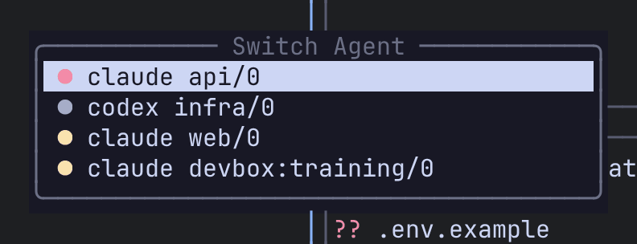

Remux notices which panes are running an AI coding agent such as Claude Code or Codex, and tells you what each one is doing. It answers one question across every session and machine: which of my agents needs me right now?

It works out of the box for `claude`, `codex`, `aider`, `gemini`, `omp` and `opencode`. The `[agents]` config section is optional.

## Agent states

Each agent pane is in one of three states, checked in this order:

| State | Colour (default) | Meaning |
|---|---|---|
| Needs input | red | A configured pattern matches the bottom of the pane's screen: the agent is blocked on a prompt or question. |
| Working | yellow | Output reached the pane within the last `working_ms` milliseconds. |
| Idle | dim | Neither. |

"Needs input" wins over "working": a spinner running under an approval prompt is still blocked. It also never fades on silence, because the prompt is still on screen.

The colours are theme roles: needs input uses `tab_bell_fg`, working uses `tab_activity_fg` and idle uses `status_bar_fg`. See [Theme](/remux/theme/).

## See your agents

### Agent switcher

Press `Alt-a` (or `Ctrl-a x a`) to open a list of every agent pane on the local server and every connected [remote](/remux/remotes/), coloured by state. It needs no sidebar.

| Key | Action |
|---|---|
| `j` / `k` (or arrows) | Move |
| `g` / `G` | Jump to the top / bottom |
| `Enter` or `l` | Jump to that pane |
| `Esc` or `q` | Close |



### Agents panel

For an always-visible list, dock an `agents` panel in a [sidebar](/remux/sidebars/):

```toml
[[sidebar]]
edge = "right"
size = 34

  [[sidebar.panel]]
  plugin = "agents"
```

`j`/`k`/`g`/`G` move and `Enter` jumps to the pane. The row for the pane you are currently in is highlighted with `sidebar_current_bg`.


Agents are named by your [`pane_title`](/remux/theme/#pane-titles) template. With no template, an agent shows its window title, or `command session/tab` (for example `claude main/1`) when it has none. Agents on a remote are prefixed with the remote's name.

## Configure detection

```toml
[agents]
commands = ["claude", "codex", "aider", "gemini", "omp", "opencode"]
working_ms = 500
scan_rows = 24
```

| Key | Default | Meaning |
|---|---|---|
| `commands` | `["claude", "codex", "aider", "gemini", "omp", "opencode"]` | The foreground commands that count as an agent. Panes running anything else are not listed. |
| `working_ms` | `500` | How recently output must have arrived for a pane to read as working. |
| `scan_rows` | `24` | How many lines up from the bottom of the pane's live screen the patterns are matched against. Wrapped lines are joined first. |

The same options, with the exact built-in regexes, are in the [config reference](/remux/config-reference/#agents).

List the agent itself, never its launcher. An agent installed through npm or bun often runs as a `node` or `bun` shim, or is started with `npx`/`bunx`; Remux looks through the launcher to the agent it started. Listing `node` would put every Node REPL on the machine in the list.

:::caution
`[agents]` is read by the **server** at startup. After editing it, run `remux restart`. Saving the file alone changes nothing.
:::

## Blocked-prompt patterns

Each `[[agents.pattern]]` is a regular expression matched line by line against the bottom of the pane's screen. A match means the agent is waiting for you.

```toml
[[agents.pattern]]
name = "claude-proceed"
command = "claude"
regex = "(?i)do you want to (proceed|continue|allow|use this api key)"
```

| Field | Meaning |
|---|---|
| `name` | A short label, written to the server log when this pattern decides a pane's state. |
| `command` | The agent this pattern applies to. Omit it to apply the pattern to every agent. |
| `regex` | The pattern, in Rust regex syntax. An invalid one is logged and skipped; the others still work. |

Remux ships these patterns:

| Name | Agent | Matches |
|---|---|---|
| `claude-proceed` | `claude` | Permission prompts ("Do you want to proceed?" and similar) |
| `claude-select` | `claude` | The question menu's footer ("Enter to select … Esc to cancel") |
| `codex-approve` | `codex` | Approval prompts ("Would you like to run …") |
| `codex-decline` | `codex` | The "No, and tell Codex what to do differently" option |
| `omp-allow` | `omp` | "Allow tool:" |
| `opencode-permission` | `opencode` | "Permission required" |
| `opencode-allow` | `opencode` | The "Allow once / Allow always / Reject" row |

:::caution
Declaring **any** `[[agents.pattern]]` replaces the whole shipped set; there is no merge. Copy the defaults you want to keep from `config.sample.toml` into your config alongside your own.
:::

:::tip
Match something that disappears once the prompt is answered, such as a hint line. A pattern that matches text left behind after you answer keeps the pane red indefinitely.
:::

The server log records why each pane was classified as it was, and which pattern matched. If a pane is stuck on "needs input" or never turns red, check `server.log` (see [Troubleshooting](/remux/troubleshooting/#logs)), adjust the pattern and run `remux restart`.

## Platform support

Detection reads the pane's foreground process, so it sees `claude` running inside your shell. It works on **Linux and macOS**. What matters is the platform of the **server** running the pane: a macOS client attached to a Linux server detects fine, and the reverse too.

A server that cannot detect agents shows `<server>: no detection` in the list (for example `local: no detection`) rather than an empty list that would look like "no agents running".

## Related

- [Sidebars](/remux/sidebars/): dock the agents panel.
- [Remotes](/remux/remotes/): see agents on other machines.
- [Theme](/remux/theme/): state colours and `pane_title`.
