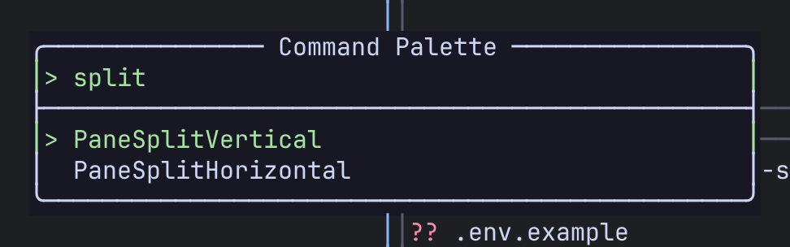

Remux has two kinds of binding, and both are configured in `[keybindings.command]`:

- **Leader bindings.** Press the leader (`Ctrl-a` by default) and then one key, or a short sequence of keys, from a tree. A which-key popup shows what each key does as you go.
- **Shortcuts.** A single key with a modifier, such as `Alt-h`, that works straight from Normal mode without the leader.

Your bindings are merged on top of the defaults, so you only write the keys you want to change. Edits apply as soon as you save the file, with no restart.

On this page, `Prefix` stands for the leader, `Ctrl-a` by default. For a task-by-task tour of the default keys, see [Keyboard](/remux/keyboard/).

## Modes

| Mode | How you get there | What keys do |
|---|---|---|
| Normal | The default. `Esc` from any other mode. | Shortcuts first. Then the leader enters Command mode. Every other key goes to the program in the pane. |
| Command | The leader | Each key moves through the leader tree. `Esc` or a key with no binding returns to Normal. |
| Visual | `Prefix v` | Scrollback navigation and selection. See [Visual mode](#visual-mode). |
| Search | `Prefix s s`, or `/` in Visual mode | Type a query, `Enter` to search, then `n`/`N` to step through matches. |
| Command palette | `Prefix :` | Type to filter every command, `Tab` to complete, `Enter` to run. |
| Session manager | `Prefix x m` | The session tree, with its own [chords](#session-manager-chords). |



## The leader

```toml
[keybindings.command]
leader = "Ctrl-a"
```

The leader takes the same [key notation](#key-notation) as shortcuts. A value that does not parse falls back to `Ctrl-a`.

:::caution[Changing the leader]
Pressing the leader twice looks up the leader's own letter in the tree. With the default, `Ctrl-a Ctrl-a` runs the `a` binding, which sends a literal `Ctrl-a` to the pane. If you change the leader, that binding does not follow. With `leader = "Ctrl-b"`, pressing the leader twice opens the `b` (Sidebar) group, and `Prefix a` still sends `Ctrl-a`. Rebind them together:

```toml
[keybindings.command]
leader = "Ctrl-b"
b = "SendKey Ctrl-b; EnterNormal"  # Ctrl-b Ctrl-b sends Ctrl-b to the pane
a = ""                             # drop the old send-Ctrl-a binding

[keybindings.command.B]            # the Sidebar group, moved to B
_label = "Sidebar"
h = "SidebarToggleLeft"
l = "SidebarToggleRight"
j = "SidebarToggleBottom"
b = "SidebarCycle"
```

A plain binding on `b` replaces the whole default `b` group, which is why the sidebar keys move.
:::

## Leader bindings

Under `[keybindings.command]`, a **single-character key** is a binding pressed right after the leader, and a **sub-table** is a group:

```toml
[keybindings.command]
v = "EnterVisualMode"               # Prefix v

[keybindings.command.t]             # Prefix t …
_label = "Tab"                      # name shown in the which-key popup
n = "TabNew; EnterNormal"           # Prefix t n
c = "TabClose; EnterNormal"         # Prefix t c (added)
x = ""                              # Prefix t x (default removed)
```

- Keys in the tree are single characters. Uppercase counts as a different key (`p H` is not `p h`). Use `" "` for the space bar.
- Only plain characters reach the tree. `Tab`, `Enter`, arrows and modified keys cannot be bound inside a group.
- Groups nest: `[keybindings.command.p.S]` is the `Prefix p S` group.
- A group you re-declare is merged with the default one. Only the keys you list change.
- The built-in Resize group (`Prefix p R`) is **sticky**: after a resize the popup stays open so you can press `h`/`j`/`k`/`l` again. `Esc` or any unbound key closes it. Groups you define yourself are not sticky.
- In the which-key popup, a binding you added is labelled with its action string.

### Action chains

A value is one action or several separated by `;`. They run in order.

```toml
n = "TabNew; EnterNormal"       # new tab, back to Normal
N = "PaneNew"                   # new pane, stay in Command mode
R = "PaneNew; ResizeRight 10"   # new pane, widen it, stay in Command mode
```

- With `EnterNormal` in the chain, you are back in Normal mode afterwards. Without it, you stay in Command mode at the top of the tree, ready for another binding.
- An action that opens something (a prompt, the palette, a switcher, a picker) ends the chain there.
- Arguments are separated by spaces. Put an argument that contains spaces in double quotes.

### Unbinding

Set a key to an empty string to remove it. This works for tree keys and for shortcuts:

```toml
[keybindings.command]
"Alt-z" = ""      # remove the Alt-z shortcut

[keybindings.command.p]
s = ""            # remove Prefix p s
```

## Shortcuts

Shortcuts are the `"<Modifier>-<key>"` entries under `[keybindings.command]`. They are checked in Normal mode **before** the key reaches the pane, and before the leader.

```toml
[keybindings.command]
"Alt-h" = "PaneFocusLeft"
"Alt-x" = "PaneNew; PaneFocusRight"
"Alt-p" = "@p"        # open the Pane group, as if you had typed Prefix p
"Alt-z" = ""          # unbind
```

- The key needs a modifier. A plain key, or `Shift` with a character, is skipped and a warning goes to the log.
- The value is an action chain, `""` to unbind, or `@<path>` to open a group of the tree (`"@p"`, `"@pR"`). An `@` path that is not a group is reported as an error.
- A shortcut stays in Normal mode. It does not need `EnterNormal`.
- A shortcut on your leader key replaces the leader.

## Key notation

Used by `leader`, shortcut keys and `SendKey`.

| Form | Examples |
|---|---|
| A single character | `a`, `H`, `,`, `1` |
| One modifier + a key | `Ctrl-a`, `Alt-h`, `Alt-Space`, `Shift-Tab` |
| A named key | `Enter`, `Esc`, `Tab`, `BackTab`, `Space`, `Backspace`, `Up`, `Down`, `Left`, `Right`, `F1`–`F12` |

- Modifiers are `Ctrl-`, `Alt-` and `Shift-`. Only **one** is allowed. `Ctrl-Alt-x` does not parse.
- For Alt with Shift, write the uppercase character: `Alt-H` is `Alt+Shift+h`.
- Names are case-sensitive: `Ctrl-a`, not `ctrl-a` or `C-a`.

## SendKey

`SendKey <key>` writes a key to the focused pane. It is how `Prefix a` passes the leader through:

```toml
[keybindings.command]
a = "SendKey Ctrl-a; EnterNormal"
```

Only characters are sent. `Ctrl-<letter>` sends the control character; `Alt` and `Shift` are dropped, so `SendKey Alt-x` sends a plain `x`. Named keys such as `Enter` or `Esc` send nothing.

## Default bindings

### Leader tree

`Prefix` is the leader, `Ctrl-a` by default.

| Keys | Action | Notes |
|---|---|---|
| `Prefix Space` | `LayoutNext` | Cycle the tab's layout |
| `Prefix f` | `PaneToggleZoom` | Zoom the focused pane |
| `Prefix g` | `ToggleStyle` | Switch between zellij and tmux border styles |
| `Prefix v` | `EnterVisualMode` | |
| `Prefix :` | `CommandPaletteOpen` | |
| `Prefix a` | `SendKey Ctrl-a` | Send the leader to the pane |
| `Prefix }` / `Prefix {` | `TabNext` / `TabPrev` | |
| **Pane**: `Prefix p …` | | |
| `n` | `PaneNew` | |
| `x` | `PaneClose` | |
| `v` | `PaneSplitVertical` | New pane to the right |
| `s` | `PaneSplitHorizontal` | New pane below |
| `h` `j` `k` `l` | `PaneFocusLeft/Down/Up/Right` | |
| `H` `J` `K` `L` | `PaneMoveLeft/Down/Up/Right` | |
| `z` | `PaneToggleZoom` | |
| `o` | `PopupToggle` | Floating popup terminal |
| `m` | `SetMaster` | |
| `r` | `PaneRename` | Prompts for a name |
| `t` | `PaneMoveToTab` | Opens a tab picker |
| `a` | `PaneStackAdd` | |
| `]` / `[` | `PaneStackNext` / `PaneStackPrev` | |
| `S h/j/k/l` | `PaneStackIntoLeft/Down/Up/Right` | Join the neighbour's stack |
| `U h/j/k/l` | `PaneUnstackLeft/Down/Up/Right` | Leave the stack |
| `R h/j/k/l` | `ResizeLeft/Down/Up/Right 5` | Sticky: keep pressing |
| **Tab**: `Prefix t …` | | |
| `n` | `TabNew` | |
| `x` | `TabClose` | |
| `r` | `TabRename` | Prompts for a name |
| `]` / `[` | `TabNext` / `TabPrev` | |
| `m` | `TabMove` | Moves the tab to the first position |
| `1`–`9` | `TabGoto 0`–`TabGoto 8` | |
| **Session**: `Prefix x …` | | |
| `s` | `SessionQuickSwitch` | Session switcher |
| `a` | `AgentQuickSwitch` | Agent switcher |
| `o` | `SessionSwitchLast` | Previous session |
| `n` | `SessionNew` | Prompts for a name |
| `r` | `SessionRename` | Prompts for a name |
| `d` | `SessionDetach` | |
| `m` | `OpenSessionManager` | |
| `f` | `SessionMoveToFolder` | Opens a folder picker |
| **Search**: `Prefix s …` | | |
| `s` | `EnterSearchMode` | |
| `e` | `BufferEditInEditor` | Scrollback in your editor |
| **View**: `Prefix w …` | | |
| `n` | `ViewNew` | |
| `a` | `ViewAddPane` | |
| `r` | `ViewRename` | |
| `x` | `ViewRemovePane` | |
| `Space` | `ViewLayoutNext` | |
| `q` | `ViewClose` | |
| `d` | `ViewDelete` | |
| **Sidebar**: `Prefix b …` | | |
| `h` / `l` / `j` | `SidebarToggleLeft` / `Right` / `Bottom` | |
| `b` | `SidebarCycle` | |

The `SidebarFocus*` actions have no default key. `Alt-h/j/k/l` move into and out of a sidebar the same way they move between panes.

### Shortcuts

| Key | Action |
|---|---|
| `Alt-h` `Alt-j` `Alt-k` `Alt-l` | `PaneFocusLeft/Down/Up/Right` |
| `Alt-H` `Alt-J` `Alt-K` `Alt-L` | `PaneMoveLeft/Down/Up/Right` |
| `Alt-,` / `Alt-.` | `TabPrev` / `TabNext` |
| `Alt-1` … `Alt-9` | `TabGoto 0` … `TabGoto 8` |
| `Alt-t` | `TabNew` |
| `Alt-s` | `SessionQuickSwitch` |
| `Alt-a` | `AgentQuickSwitch` |
| `Alt-o` | `SessionSwitchLast` |
| `Alt-z` | `PaneToggleZoom` |
| `Alt-p` | `PopupToggle` |
| `Alt-m` | `SetMaster` |
| `Alt-Space` | `LayoutNext` |

## Session manager chords

Inside the session manager (`Prefix x m`), one- or two-key chords act on the selected row. Rebind them under `[keybindings.session_manager]`:

```toml
[keybindings.session_manager]
tn = "TabNew"
tc = "TabClose"    # add a chord
tx = ""            # remove a default chord
```

| Chord | Action | Chord | Action |
|---|---|---|---|
| `tn` | `TabNew` | `sn` | `SessionNew` |
| `tx` | `TabClose` | `sx` | `SessionClose` |
| `tr` | `TabRename` | `sr` | `SessionRename` |
| `th` | `TabMoveLeft` | `sm` | `SessionMove` |
| `tl` | `TabMoveRight` | `fn` | `FolderNew` |
| `pn` | `PaneNew` | `fx` | `FolderDelete` |
| `px` | `PaneClose` | `fr` | `FolderRename` |
| `pr` | `PaneRename` | `va` | `AddToView` |
| `vr` | `ViewRename` | `vx` | `ViewRemoveCell` |
| `vd` | `ViewDelete` | | |

- A chord is one or two printable characters. An invalid chord or an unknown action is skipped with a warning.
- If a character starts any two-key chord, a one-key chord on that same character is dropped, because the two-key chord wins.
- These names are only valid here. They are a separate set from the commands below.

The overlay's fixed keys (`Enter`, arrows, `j`/`k`, `h`/`l`, `q`, and so on) are not configurable. Chords are checked first. See [Sessions & persistence](/remux/sessions/).

## Visual mode

Visual mode keys are built in and cannot be rebound. `[keybindings.visual]` is accepted in the config but has no effect. The keys are listed in [Keyboard](/remux/keyboard/#visual-mode).

## Commands

Every action you can bind or run from the command palette. The names are PascalCase and case-sensitive. A typo is reported in the client log when the config loads.

### Panes

| Command | Does |
|---|---|
| `PaneNew` | Open a new pane in the active tab |
| `PaneClose` | Close the focused pane |
| `PaneSplitVertical` | Split the focused pane. The new pane goes to the right. |
| `PaneSplitHorizontal` | Split the focused pane. The new pane goes below. |
| `PaneFocusLeft` / `Right` / `Up` / `Down` | Move focus |
| `PaneMoveLeft` / `Right` | Move the focused pane. In a stack: along it, then out of it. |
| `PaneMoveUp` / `Down` | Move the focused pane. In a stack: out of it, above or below. |
| `PaneStackAdd` | Add the focused pane to a stack |
| `PaneStackNext` / `PaneStackPrev` | Focus the next or previous pane in the stack |
| `PaneStackIntoLeft` / `Right` / `Up` / `Down` | Move the focused pane into that neighbour's stack |
| `PaneUnstackLeft` / `Right` / `Up` / `Down` | Take the focused pane out of its stack, on that side |
| `PaneToggleZoom` | Zoom or unzoom the focused pane |
| `PaneRename` | Rename the focused pane (prompts) |
| `PaneMoveToTab` | Move the focused pane to another tab or a new one (opens a picker) |
| `PopupToggle` | Show or hide the session's floating popup terminal |
| `ResizeLeft` / `Right` / `Up` / `Down` `[amount]` | Resize the focused pane by `amount` cells (default `1`) |
| `SetMaster` | Make the focused pane the master pane |

### Tabs

| Command | Does |
|---|---|
| `TabNew` | Create a tab |
| `TabClose` | Close the active tab |
| `TabNext` / `TabPrev` | Switch to the next or previous tab |
| `TabGoto <index>` | Switch to a tab by 0-based index. The index is required. |
| `TabMove [position]` | Move the active tab to a 1-based position. `0` or no argument moves it first. |
| `TabRename` | Rename the active tab (prompts) |

### Layouts

| Command | Does |
|---|---|
| `LayoutNext` | Cycle to the next enabled automatic layout |
| `ToggleStyle` | Switch between zellij and tmux border styles |

### Sessions and folders

| Command | Does |
|---|---|
| `SessionNew` | Create a session (prompts for a name) |
| `SessionRename` | Rename the current session (prompts) |
| `SessionDetach` | Detach this client. The session keeps running. |
| `SessionQuickSwitch` | Open the session switcher |
| `SessionSwitchLast` | Jump back to the previous session |
| `AgentQuickSwitch` | Open the agent switcher: every pane running an AI agent |
| `OpenSessionManager` | Open the session manager |
| `SessionMoveToFolder` | Move the current session to a folder (opens a picker) |
| `SessionSave` | Save session state to disk now (when `save_sessions` is on) |
| `SessionList` | Ask the server for the session list |
| `FolderNew <name>` | Create a folder |
| `FolderDelete <name>` | Delete a folder |
| `FolderMoveSession <session> [folder]` | Move a session into a folder, or out of one if you leave `folder` off |
| `FolderList` | Accepted, but does nothing |

### Views

| Command | Does |
|---|---|
| `ViewNew` | Create a view (prompts for a name) |
| `ViewAddPane` | Add a pane to the active view |
| `ViewRename` | Rename the active view |
| `ViewRemovePane` | Drop the focused cell from the view. The pane itself is untouched. |
| `ViewLayoutNext` | Cycle the view's layout |
| `ViewClose` | Leave the view. It keeps existing. |
| `ViewDelete` | Delete the active view |

See [Views](/remux/views/).

### Sidebars

| Command | Does |
|---|---|
| `SidebarToggleLeft` / `Right` / `Bottom` | Show or hide that sidebar |
| `SidebarFocusLeft` / `Right` / `Bottom` | Focus that sidebar, opening it if it is hidden |
| `SidebarCycle` | Move focus through every panel, then back to the panes |

See [Sidebars](/remux/sidebars/).

### Remotes

| Command | Does |
|---|---|
| `RemoteConnect <user@host\|alias>` | Open the session manager and connect to a remote, by SSH destination or by a `[remotes.<name>]` name |
| `RemoteDisconnect <alias\|dest>` | Disconnect a remote. Its sessions leave the switcher and tree. Nothing on the remote is stopped. |

See [Remotes over SSH](/remux/remotes/).

### Modes and input

| Command | Does |
|---|---|
| `EnterNormal` | Return to Normal mode |
| `EnterCommandMode` | Enter Command mode |
| `EnterVisualMode` | Enter Visual mode |
| `EnterSearchMode` | Search the scrollback |
| `BufferEditInEditor` | Open the scrollback in your editor |
| `CommandPaletteOpen` | Open the command palette |
| `SendKey <key>` | Send a key to the focused pane (not listed in the palette) |

:::note[Commands that prompt]
`TabRename`, `PaneRename`, `SessionRename` and `SessionNew` always open a name prompt, from a binding or from the palette. An argument written after them, such as `SessionNew "my project"`, is ignored.
:::

## Related

- [Keyboard](/remux/keyboard/): a tour of the default keys
- [Configuration](/remux/configuration/): where the file lives and what reloads live
- [Config reference](/remux/config-reference/): every other option
