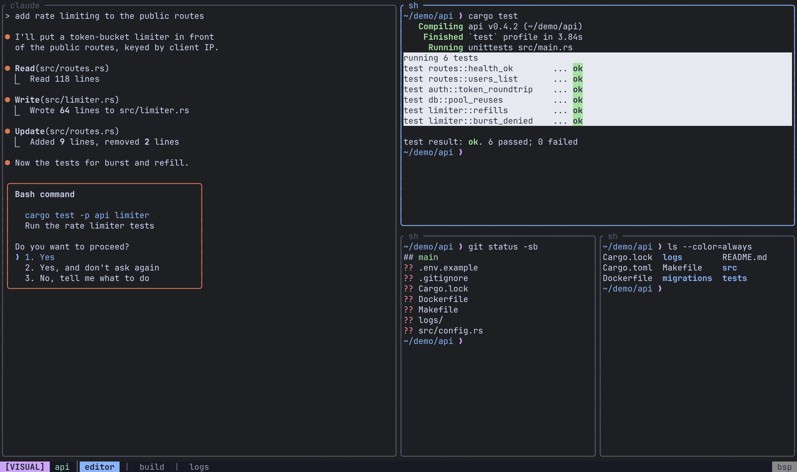
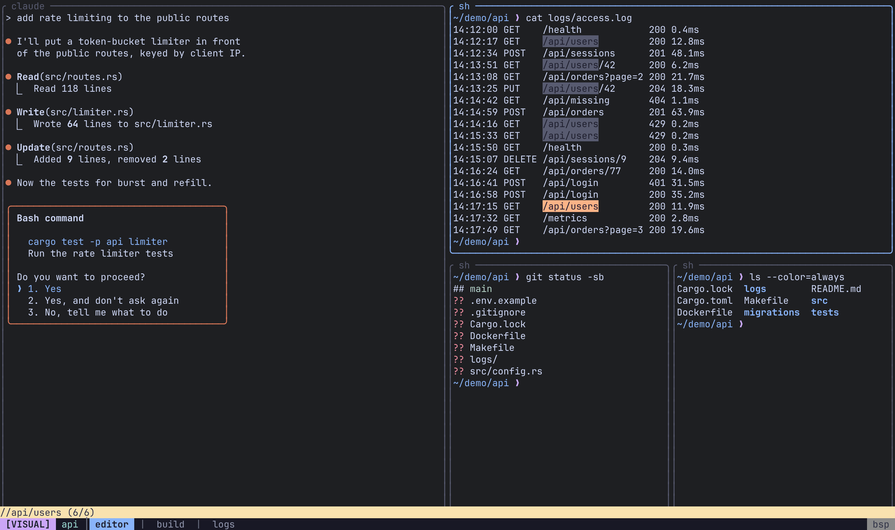

Remux keeps out of your way until you ask for it. In Normal mode every key goes to the program in the focused pane, except two kinds: the **prefix** (`Ctrl-a`), which opens a tree of commands, and a small set of **`Alt` shortcuts**, which act immediately. This page is a tour of the default keys by task. Every one of them can be changed; [Keybindings](/remux/keybindings/) has the full default key map with the action behind each key, and shows how to rebind them.

## Modes

| Mode | What keys do | Enter with | Leave with |
|---|---|---|---|
| Normal | Go to the focused pane's program | `Esc` from any other mode | — |
| Command | Walk the key tree | `Ctrl-a` | `Esc`, or a key that runs a command |
| Visual | Move through scrollback and select | `Ctrl-a v` | `Esc` |
| Search | Type a scrollback search | `/` in Visual mode, or `Ctrl-a s s` | `Esc` |

## The prefix and which-key

Press `Ctrl-a` to enter Command mode. The keys that follow walk a tree: `p` opens the pane group, `t` the tab group, and so on, until you reach a key that runs a command. A **which-key** popup lists what you can press at the current level, along with the global `Alt` shortcuts.

Most commands return you to Normal mode once they run. `Esc` returns to Normal from any depth of the tree.

To send a literal `Ctrl-a` to the program in the pane, press `Ctrl-a a`.

`which_key_position` under `[appearance]` sets where the popup is drawn: `anchored` (the default) at the bottom of the screen, `centered` in the middle, or `full_width` across the whole width above the status bar. See [Theme](/remux/theme/#which-key-popup).

## Alt shortcuts

These work directly in Normal mode, with no prefix.

| Action | Keys |
|---|---|
| Focus left / down / up / right (also into and out of a sidebar) | `Alt-h` / `Alt-j` / `Alt-k` / `Alt-l` |
| Move the pane left / down / up / right | `Alt-H` / `Alt-J` / `Alt-K` / `Alt-L` |
| Previous / next tab | `Alt-,` / `Alt-.` |
| Jump to tab 1 to 9 | `Alt-1` … `Alt-9` |
| New tab | `Alt-t` |
| Quick session switcher | `Alt-s` |
| Agent switcher | `Alt-a` |
| Previous session | `Alt-o` |
| Zoom the focused pane | `Alt-z` |
| Toggle the popup terminal | `Alt-p` |
| Cycle the layout | `Alt-Space` |
| Make the focused pane the master (Master layout) | `Alt-m` |

## Prefix key tree

Keys below follow `Ctrl-a`. For the action name behind each key, which is what you write in the config to rebind it, see [Default bindings](/remux/keybindings/#default-bindings).

### Top level

| Action | Keys |
|---|---|
| Pane group | `p` |
| Tab group | `t` |
| Session group | `x` |
| Search group | `s` |
| View group | `w` |
| Sidebar group | `b` |
| Visual mode | `v` |
| Cycle the layout | `Space` |
| Zoom the focused pane | `f` |
| Next / previous tab | `}` / `{` |
| Toggle border style (Zellij / tmux) | `g` |
| Command palette | `:` |
| Send a literal `Ctrl-a` | `a` |

### Panes: `p`

| Action | Keys |
|---|---|
| New pane (placed by the layout) | `p n` |
| Split side by side / top and bottom | `p v` / `p s` |
| Close the pane | `p x` |
| Focus left / down / up / right | `p h` / `p j` / `p k` / `p l` |
| Move the pane left / down / up / right | `p H` / `p J` / `p K` / `p L` |
| Zoom | `p z` |
| Toggle the popup terminal | `p o` |
| Make the pane the master | `p m` |
| Rename the pane | `p r` |
| Move the pane to another tab, or a new one | `p t` |
| Add the pane to a stack | `p a` |
| Next / previous pane in the stack | `p ]` / `p [` |
| Fold into the left / down / up / right neighbour's stack | `p S h` / `p S j` / `p S k` / `p S l` |
| Take out of the stack, to the left / below / above / right | `p U h` / `p U j` / `p U k` / `p U l` |
| Resize left / down / up / right by 5 | `p R h` / `p R j` / `p R k` / `p R l` |

Inside a stack, `p H` and `p L` move the pane one place along the stack, and past its end take it out into its own slot. `p J` and `p K` take it out below or above at once.

The resize group `p R` stays open after each key, so `Ctrl-a p R l l l` resizes three steps in a row. Press `Esc` when you're done.

### Tabs: `t`

| Action | Keys |
|---|---|
| New tab | `t n` |
| Close the tab | `t x` |
| Rename the tab | `t r` |
| Next / previous tab | `t ]` / `t [` |
| Move the tab | `t m` |
| Jump to tab 1 to 9 | `t 1` … `t 9` |

### Sessions: `x`

| Action | Keys |
|---|---|
| Quick session switcher | `x s` |
| Agent switcher | `x a` |
| Previous session | `x o` |
| New session | `x n` |
| Rename the session | `x r` |
| Detach | `x d` |
| Session manager | `x m` |
| Move the session to a folder | `x f` |

### Search: `s`

| Action | Keys |
|---|---|
| Search scrollback | `s s` |
| Open scrollback in `$EDITOR` | `s e` |

### Views: `w`

| Action | Keys |
|---|---|
| New view | `w n` |
| Add the focused pane to a view | `w a` |
| Rename the view | `w r` |
| Remove the focused cell from the view | `w x` |
| Cycle the view's layout | `w Space` |
| Leave the view | `w q` |
| Delete the view | `w d` |

See [Views](/remux/views/).

### Sidebars: `b`

| Action | Keys |
|---|---|
| Show or hide the left / right / bottom sidebar | `b h` / `b l` / `b j` |
| Cycle focus through the visible panels, then back to the panes | `b b` |

`Alt-h/j/k/l` move into and out of a sidebar the same way they move between panes. See [Sidebars](/remux/sidebars/).

## Visual mode

Visual mode moves a cursor through the focused pane's scrollback, vim style.

| Action | Keys |
|---|---|
| Move left / down / up / right | `h` / `j` / `k` / `l` |
| Half a page down / up | `Ctrl-d` / `Ctrl-u` |
| Top / bottom of the scrollback | `gg` / `G` |
| Start a character-wise selection | `v` or `Space` |
| Start a line-wise selection | `V` |
| Copy the selection to the clipboard | `y` |
| Search | `/` |
| Previous (older) / next (newer) match | `n` / `N` (or `p`) |
| Open scrollback in `$EDITOR` | `e` |
| Back to Normal | `Esc` |

## Search mode

Type the query and press `Enter`. Matches are highlighted and you land in Visual mode on the most recent one, where `n` moves to earlier matches and `N` to later ones. `Backspace` edits the query; `Esc` cancels and clears the highlights.

## Session manager

`Ctrl-a x m` opens the session manager, a tree of every folder, session, tab and pane on your local server and connected remotes.

| Action | Keys |
|---|---|
| Move | `j` / `k` or `Down` / `Up` |
| Switch to the selected node | `Enter` |
| Expand (connects a remote) / collapse | `l` / `h`, or `Right` / `Left` |
| Filter the tree | `/` |
| Mark a pane for a view | `Space` |
| Add the marked panes to a view | `va` |
| New session / new folder | `n` / `c` |
| Close | `Esc` or `q` |

It also takes two-key chords for acting on the selected row, such as `tr` to rename a tab or `sx` to close a session. See [Sessions & persistence](/remux/sessions/) for the full list.

## Next steps

- [Keybindings](/remux/keybindings/): rebind or unbind keys, change the prefix, chain commands.
- [Layouts](/remux/layouts/): what `Alt-Space` cycles through.
- [CLI reference](/remux/cli/): the `remux` commands.
