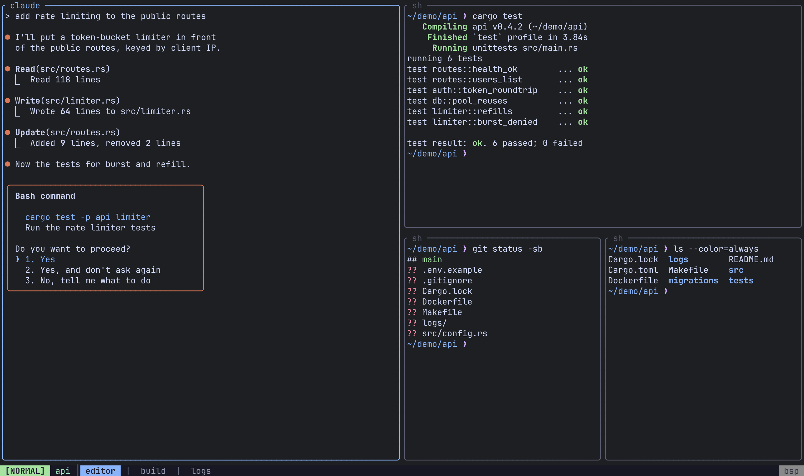
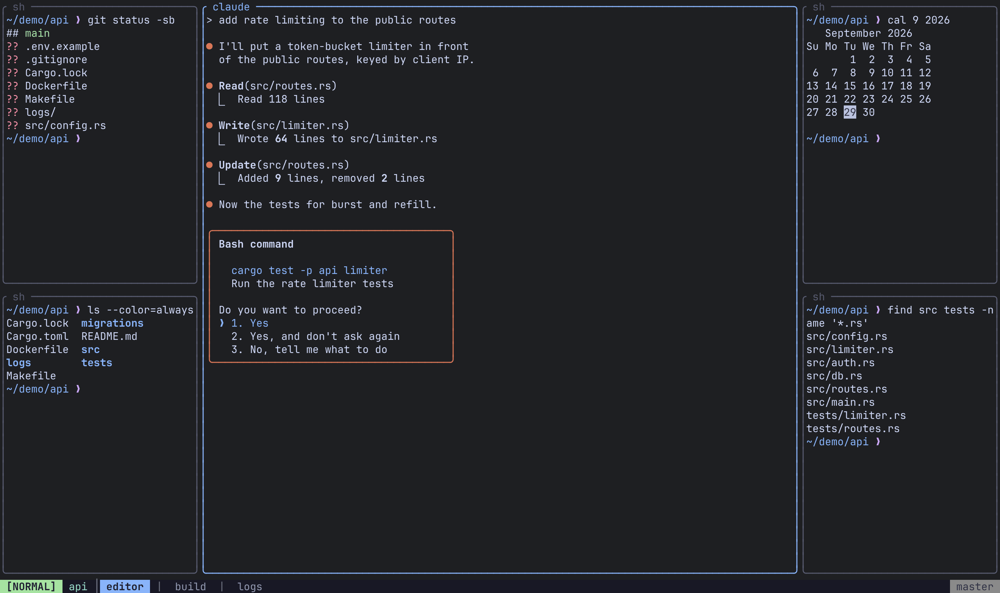
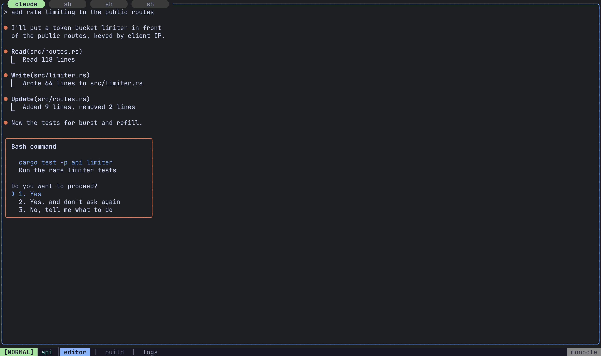
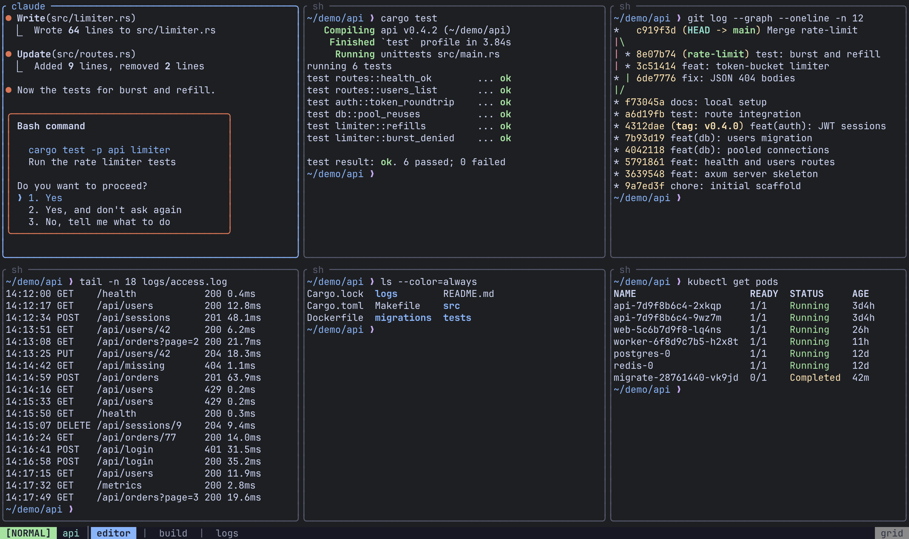
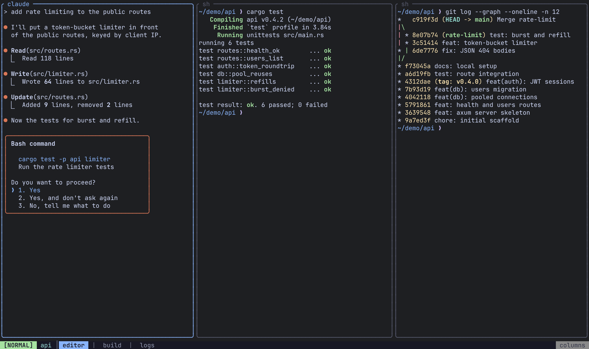
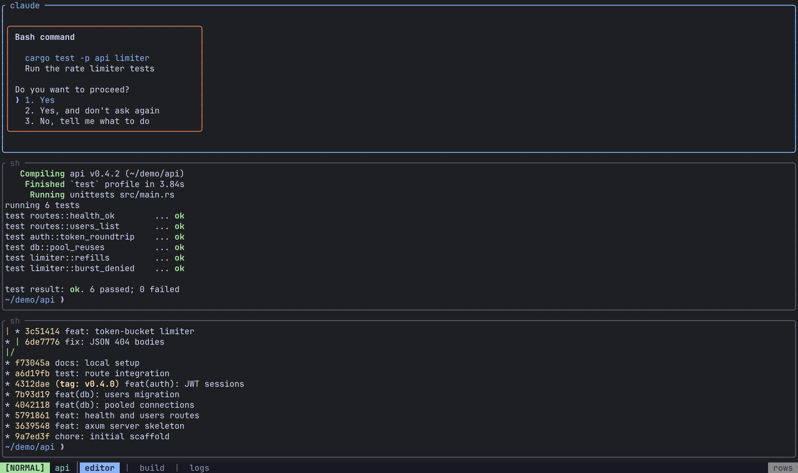
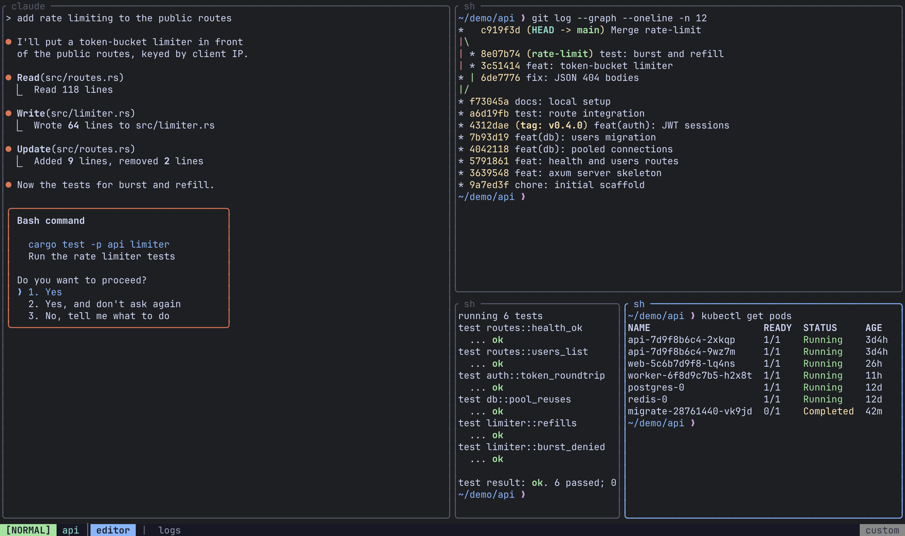
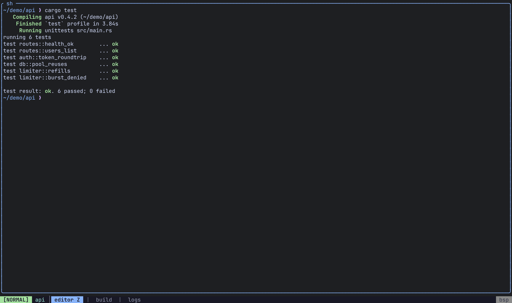
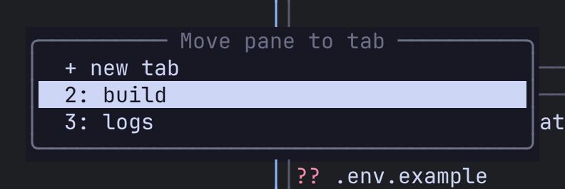

Every tab has a layout mode that decides where its panes go. Six are **automatic**: Remux arranges the panes for you and rearranges them whenever a pane opens or closes. The seventh, **Custom**, is whatever you built by hand with splits, moves and resizes. The current layout's name is shown on the status bar.

## Cycle layouts

| Action | Keys |
|---|---|
| Next layout | `Alt-Space` or `Ctrl-a Space` |
| Promote the focused pane to master | `Alt-m` or `Ctrl-a p m` |

The cycle runs **Bsp → Master → Monocle → Grid → Columns → Rows** and back to Bsp. If the tab was in Custom when you started cycling, Remux remembers that arrangement: after the last automatic layout the cycle returns to it instead of wrapping to Bsp. That only happens while the tab still has exactly the panes the arrangement was made for; open or close a pane in between and the cycle stays automatic.

Cycling a layout releases a zoomed pane.

## The automatic layouts

### Bsp

The default. Each pane splits the space left over by the previous one in half, alternating between side-by-side and top-and-bottom, so panes shrink as they spiral into the corner.



### Master

One **master** pane gets 60% of the width. With two panes the master sits on the left; with three or more it sits in the centre and the other panes alternate between a column on its left and a column on its right, sharing each column's height equally.

`Alt-m` (or `Ctrl-a p m`) makes the focused pane the master, switching the tab to Master if it isn't in it already.



### Monocle

One pane fills the whole tab; the others are stacked behind it. A strip across the top names every pane, and you move between them the way you move through a [stack](#pane-stacks): `Ctrl-a p ]` and `Ctrl-a p [`, or by clicking a name.



### Grid

Equal cells in a grid with `ceil(sqrt(n))` columns, filled row by row. When the last row is short, its cells are wider. Grid is also where a new [View](/remux/views/) starts.



### Columns

Every pane side by side, left to right, each the full height and an equal share of the width.



### Rows

Every pane stacked top to bottom, each the full width and an equal share of the height.



## Custom

The moment you arrange panes by hand, the tab switches to Custom and Remux stops rearranging it. Any of these does it:

- splitting a pane (`Ctrl-a p v`, `Ctrl-a p s`)
- resizing (`Ctrl-a p R` then `h`/`j`/`k`/`l`)
- moving a pane (`Alt-H`/`J`/`K`/`L`)
- stacking or unstacking a pane

`Ctrl-a p n` is the exception: it opens a pane *placed by the current layout*, so an automatic tab stays automatic.



`Ctrl-a p R` is a sticky group: after the first resize the which-key menu stays open, so you can keep pressing `h`/`j`/`k`/`l` to resize by 5 cells at a time. Press `Esc` when you're done.

## Choose the default and the cycle

`default_layout` sets the layout every new tab starts in: a new session's first tab, `Ctrl-a t n`, `remux new-tab`, and a pane moved to a new tab.

```toml
[appearance]
default_layout = "grid"   # bsp (default) | master | monocle | grid | columns | rows | custom
```

The `[layouts]` section turns automatic layouts on and off. Every layout is enabled by default; setting one to `false` drops it from the cycle for tabs and Views alike, without changing the order of the rest.

```toml
[layouts]
master = false
monocle = false
```

- A new tab or View whose layout is disabled starts in the first enabled layout instead, and a warning goes to the log.
- Disabling every layout is treated as enabling all of them.
- A tab that is already in a layout you disable keeps it until you next cycle.
- Custom isn't listed. It's always reachable by splitting.

:::caution
`[layouts]` and `default_layout` are read by the **server** when it starts. Run `remux restart` after changing them.
:::

## Move panes

| Action | Keys |
|---|---|
| Move the pane left / down / up / right | `Alt-H` / `Alt-J` / `Alt-K` / `Alt-L` |
| The same, from the leader | `Ctrl-a p H` / `J` / `K` / `L` |

A move swaps the focused pane with its neighbour in that direction; focus travels with the pane. If there is no neighbour, because the pane is already at that edge, the pane is lifted out and placed against that edge, taking half the tab along its full length while everything else shares the other half.

## Zoom

| Action | Keys |
|---|---|
| Toggle zoom on the focused pane | `Alt-z`, `Ctrl-a f` or `Ctrl-a p z` |

A zoomed pane fills the tab while the rest of the layout waits behind it, untouched. The status bar shows a `Z` while a pane is zoomed.



Opening a new pane, cycling the layout or promoting a master releases the zoom. In Monocle there is nothing to zoom: the focused pane already fills the tab.

## Pane stacks

A stack is several panes sharing one slot in the layout, like tabs inside a pane. Only one is visible at a time; the slot's border lists all of them, and you can click a name to switch to it.


| Action | Keys |
|---|---|
| Open a new pane in the focused pane's stack | `Ctrl-a p a` |
| Next / previous pane in the stack | `Ctrl-a p ]` / `Ctrl-a p [` |
| Fold the focused pane into the neighbour's stack (left / down / up / right) | `Ctrl-a p S` then `h` / `j` / `k` / `l` |
| Take the focused pane out into its own slot (left / below / above / right of the stack) | `Ctrl-a p U` then `h` / `j` / `k` / `l` |

Unstacking only does something when the pane shares its stack with at least one other pane.

**Moving inside a stack.** The move keys understand stacks:

- `Alt-H` / `Alt-L` move the pane one place along its stack. At the end of the stack, the next press takes it out into its own slot on that side.
- `Alt-J` / `Alt-K` take it out of the stack at once, into a new slot below or above.

**Focus is stack-aware.** `Alt-h`/`j`/`k`/`l` step through the panes of a stack before crossing to the neighbouring slot.

The stack's names can be drawn as chips. Set `tab_style` under `[appearance.theme]` (see [Theme](/remux/theme/)):


## Move a pane to another tab

`Ctrl-a p t` opens a picker listing the session's other tabs and `+ new tab`. Move with `j`/`k` (or the arrows), `g`/`G` to jump to either end, `Enter` to pick, and `Esc` or `q` to cancel.



The pane moves with its program and scrollback intact, and the target tab becomes the active one with the pane focused.

- Into an automatic tab, the pane joins its layout.
- Into a Custom tab, it splits that tab's focused pane side by side.
- `+ new tab` builds the tab in your `default_layout`.
- A tab left with no panes is closed.
- A move that can't work is refused and leaves everything as it was: for example, sending the only pane of the only tab to a new tab.

## Related

- [Views](/remux/views/): the same layouts, applied to panes from anywhere
- [Keyboard](/remux/keyboard/) and [Keybindings](/remux/keybindings/)
- [Config reference](/remux/config-reference/)
