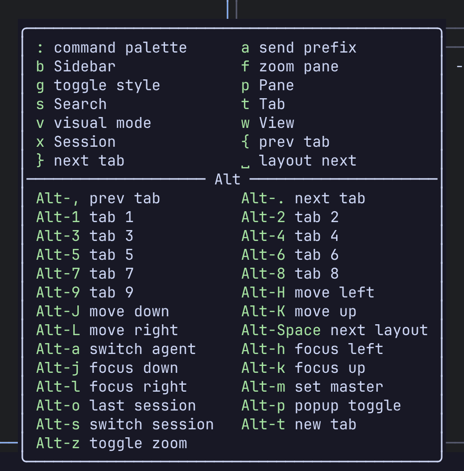
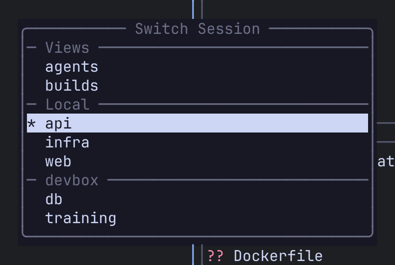

This walkthrough takes you from a fresh install to a session you can detach from and come back to. It assumes the default key map, where the prefix is `Ctrl-a`.

## Start Remux

```sh
remux
```

The first run starts the background server for you, creates a session called `main` and attaches to it. If sessions already exist, `remux` attaches to the first one instead of creating a new one.

To start a session with a name of your choosing:

```sh
remux new --session work
```

:::note
Remux refuses to start a client inside one of its own panes, the same way tmux does. Detach first or use another terminal. If you really want a nested client, set `REMUX_ALLOW_NESTED=1`.
:::

## Use the prefix

Most keys go straight to the program in the focused pane. Press `Ctrl-a` and Remux enters **Command mode**: a which-key popup lists the keys available from there, grouped by what they act on (`p` for panes, `t` for tabs, `x` for sessions, and so on). Press `Esc` to back out without doing anything.



You don't have to memorise the tree. Press `Ctrl-a`, read the popup, press the next key.

## Split panes

| Action | Keys |
|---|---|
| Split side by side | `Ctrl-a p v` |
| Split top and bottom | `Ctrl-a p s` |
| New pane, placed by the layout | `Ctrl-a p n` |
| Move focus left / down / up / right | `Alt-h` / `Alt-j` / `Alt-k` / `Alt-l` |
| Zoom the focused pane | `Alt-z` |
| Close the focused pane | `Ctrl-a p x` |

Exiting the shell in a pane also closes it.

New panes are arranged by the current layout, BSP by default. Press `Alt-Space` to cycle through the automatic layouts. See [Layouts](/remux/layouts/) for what each one does.

## Work with tabs

| Action | Keys |
|---|---|
| New tab | `Alt-t` |
| Previous / next tab | `Alt-,` / `Alt-.` |
| Jump to tab 1 to 9 | `Alt-1` … `Alt-9` |
| Rename the tab | `Ctrl-a t r` |
| Close the tab | `Ctrl-a t x` |

## Detach and reattach

Press `Ctrl-a x d` to detach. The client exits, and the session keeps running in the server with everything in it.

From any terminal:

```sh
remux ls            # list sessions
remux attach work   # attach to one by name
```

## Move between sessions

| Action | Keys |
|---|---|
| Quick session switcher | `Alt-s` |
| Back to the previous session | `Alt-o` |
| Session manager (tree of every session, tab and pane) | `Ctrl-a x m` |
| Command palette (search every command) | `Ctrl-a :` |



## Stop the server

```sh
remux stop
```

This saves your sessions and shuts the server down. The next `remux` starts a new server and, with the default settings, brings the saved sessions back.

:::tip
After installing a new build, run `remux restart` so the running server picks it up.
:::

## Next steps

- [Concepts](/remux/concepts/): the pieces Remux is made of.
- [Keyboard](/remux/keyboard/): modes, which-key and the full default key map.
- [Remotes over SSH](/remux/remotes/): put another machine's sessions in the same tree.
- [Views](/remux/views/): panes from different sessions and machines on one screen.
