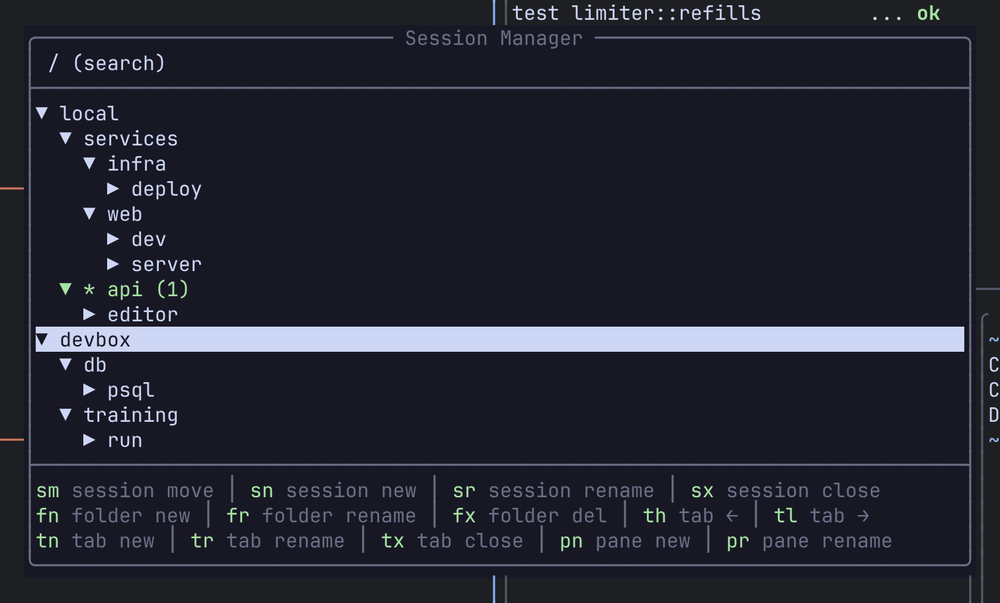

A **session** is a named set of tabs, each tab a layout of panes. Sessions live in the background Remux server, not in your terminal, so closing the terminal or detaching leaves every program running. Attach again and you're back where you were. With persistence on (the default), the server also writes sessions to disk and brings them back after a restart.

## From the command line

```sh
remux                              # attach to a session, creating "main" if there are none
remux new --session work           # create a session and attach to it
remux new --session api --folder backend   # ...filed under the "backend" folder
remux attach work                  # attach to an existing session
remux ls                           # list sessions
remux kill work                    # end a session and everything in it
```

With no arguments, `remux` starts the server if it isn't running, then attaches to the first existing session, or creates `main` if there are none. `--folder` files the new session under a session-manager folder, creating the folder if it doesn't exist.

## Session keys

| Action | Keys |
|---|---|
| Quick switcher | `Alt-s` or `Ctrl-a x s` |
| Back to the previous session | `Alt-o` or `Ctrl-a x o` |
| Session manager | `Ctrl-a x m` |
| New session (prompts for a name) | `Ctrl-a x n` |
| Rename this session | `Ctrl-a x r` |
| Move this session to a folder (opens a picker) | `Ctrl-a x f` |
| Detach | `Ctrl-a x d` |

`Alt-o` flips between the two sessions you used most recently, like tmux's last-session.

## Quick switcher

`Alt-s` opens a flat list of every session: local ones and those on each connected [remote](/remux/remotes/). Your [Views](/remux/views/) are listed at the top.


| Action | Keys |
|---|---|
| Move | `j` / `k` or the arrows |
| Switch to the highlighted entry | `Enter` or `l` |
| Close | `Esc` or `q` |

## Session manager

`Ctrl-a x m` opens a tree of everything: folders, sessions, tabs and panes on the `local` server and on every configured remote, plus your Views and any saved sessions waiting to be restored. It opens with your current session highlighted.



### Navigate

| Action | Keys |
|---|---|
| Move | `j` / `k` or the arrows |
| Expand (on a remote, this also connects it) | `l` or `→` |
| Collapse | `h` or `←` |
| Expand / collapse without connecting | `+` / `-` |
| Switch to the highlighted session, tab or pane | `Enter` |
| Search | `/` |
| Close | `Esc` or `q` |

`Enter` on a folder toggles it open. On a session, tab or pane it switches there and closes the manager.

**Search.** `/` moves the cursor to a search bar that filters the tree as you type. `Backspace` deletes a character, `Ctrl-u` clears the query, and `Tab`, `↓` or `Enter` hands the keyboard back to the tree so you can act on a match.

### Edit

| Action | Keys |
|---|---|
| New session (asks for a name, then a folder) | `n` |
| New folder | `c` |
| Move the highlighted session to a folder | `m` |
| Delete the highlighted session, folder, tab or view | `d`, then `y` to confirm |
| Mark or unmark a pane for a View | `Space` |

Two-key chords cover the rest. Press the first key, then the second:

| Chord | Action |
|---|---|
| `t` `n` / `t` `x` / `t` `r` | New tab / close tab / rename tab |
| `t` `h` / `t` `l` | Move the tab left / right |
| `p` `n` / `p` `x` / `p` `r` | New pane / close pane / rename pane |
| `s` `n` / `s` `x` / `s` `r` / `s` `m` | New / close / rename / move session |
| `f` `n` / `f` `x` / `f` `r` | New / delete / rename folder |
| `v` `a` | Add the marked panes, or the highlighted pane or tab, to a View |
| `v` `r` / `v` `x` / `v` `d` | Rename a view / remove a cell / delete a view |

Each chord acts on the highlighted row, and it works on a connected remote's tree the same as on the local one. Remap chords under `[keybindings.session_manager]`; see [Keybindings](/remux/keybindings/).

:::tip
On a connected remote's own row, `d` disconnects that remote instead of deleting anything. Nothing on the far server stops.
:::

### Folders

Folders group sessions in the tree and in the sidebar. They're purely organisational: a session in a folder behaves exactly like one outside it. Create them with `c` (or the `f` `n` chord) in the manager, file a session with `m` or `Ctrl-a x f`, or pass `--folder` to `remux new`.

## Persistence and restore

By default the server saves every session to disk after each structural change (a new tab, a closed pane, a rename) and again when it shuts down. When it starts, it restores them: the same sessions, folders, tabs and layouts, with a fresh shell in every pane, **started in the directory that pane was in**.

:::note
Restore brings back the arrangement and the working directories, not the running programs or their scrollback. A pane that was running `vim` comes back as a shell in the same directory.
:::

Two settings in `[general]` control this:

```toml
[general]
save_sessions = true       # write sessions to disk (default: true)
automatic_restore = true   # bring them back live on startup (default: true)
```

| `save_sessions` | `automatic_restore` | What happens at startup |
|---|---|---|
| `true` | `true` | Saved sessions come back live. |
| `true` | `false` | Saved sessions are listed but not started (see below). |
| `false` | ignored | Nothing is saved, so every server start is empty. |

**Dormant sessions.** With `automatic_restore = false`, saved sessions appear in the session manager under **Saved (resurrect)** without starting any shells. Highlight one and press `Enter` to bring it back to life. This applies to the local server.

To save right away instead of waiting for the next change, run `SessionSave` from the command palette (`Ctrl-a :`).

## Working directories

New panes and tabs open where you're working. A split, a new pane or a new tab starts in the directory of the pane that had focus, so `Ctrl-a p v` in `~/project/api` gives you a second shell in `~/project/api`.

## Stop and restart the server

```sh
remux stop      # stop the server, saving sessions first
remux restart   # stop it and start it again
```

Both ask the server to shut down cleanly, which saves your sessions when `save_sessions` is on. `remux restart` then starts a fresh server, which restores them.

Restart after changing a setting the server reads at startup, such as `[general]`, `[layouts]` or `[agents]`, and after rebuilding or upgrading Remux: a running server keeps serving the old binary until it is replaced.

:::caution
[Views](/remux/views/) are kept in memory only and don't survive a stop or restart.
:::

## Related

- [Remotes over SSH](/remux/remotes/): sessions on other machines in the same tree
- [Views](/remux/views/)
- [CLI reference](/remux/cli/)
- [Config reference](/remux/config-reference/)
