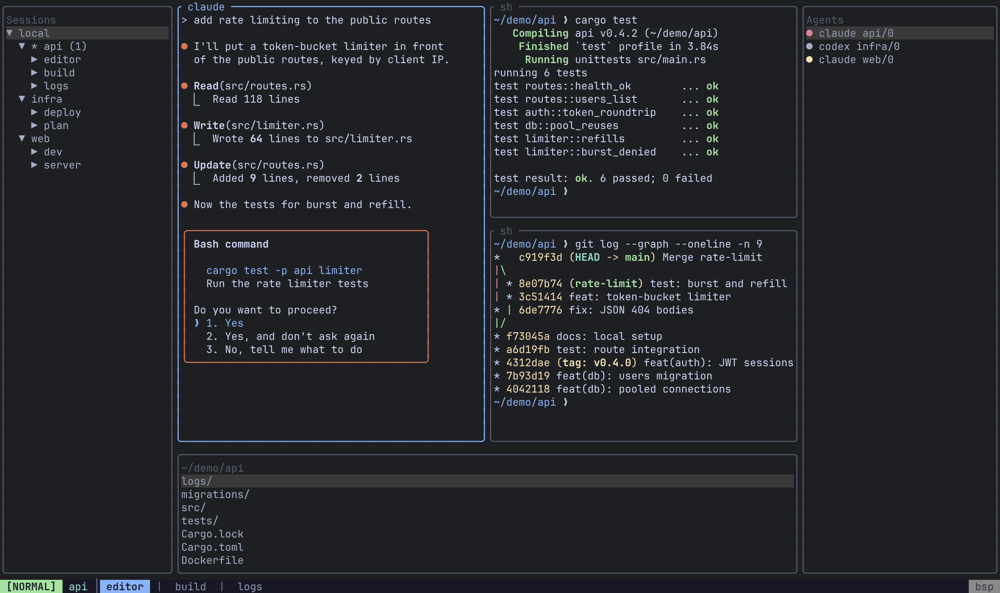
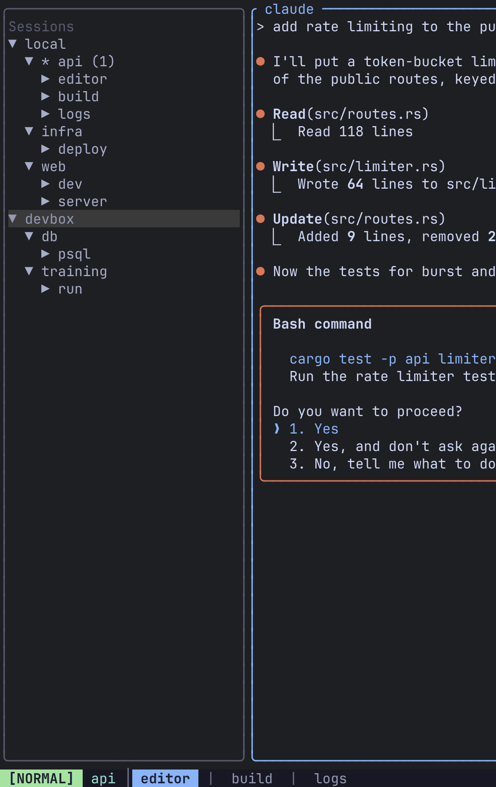
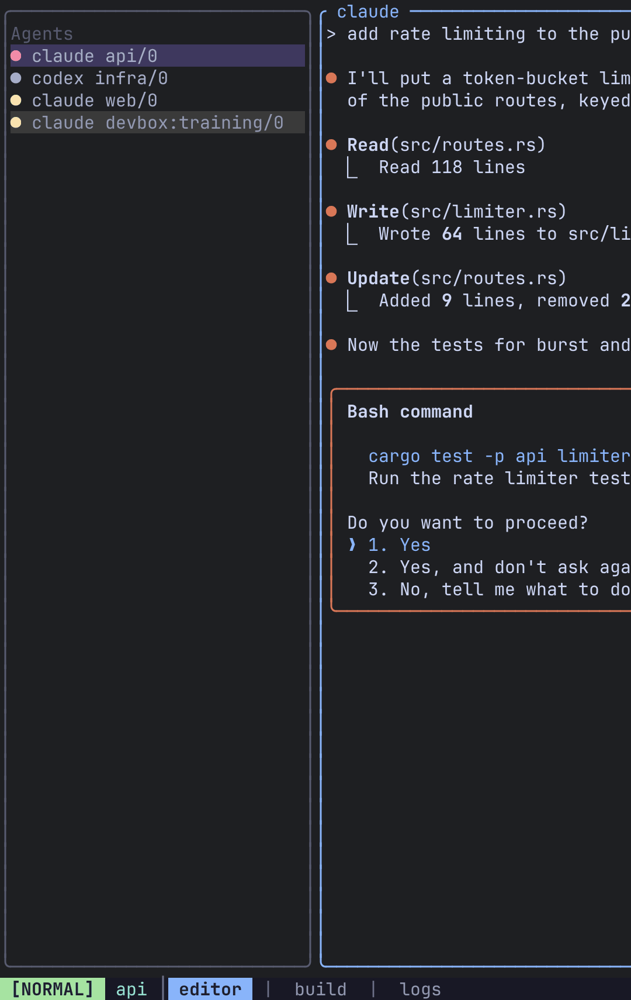
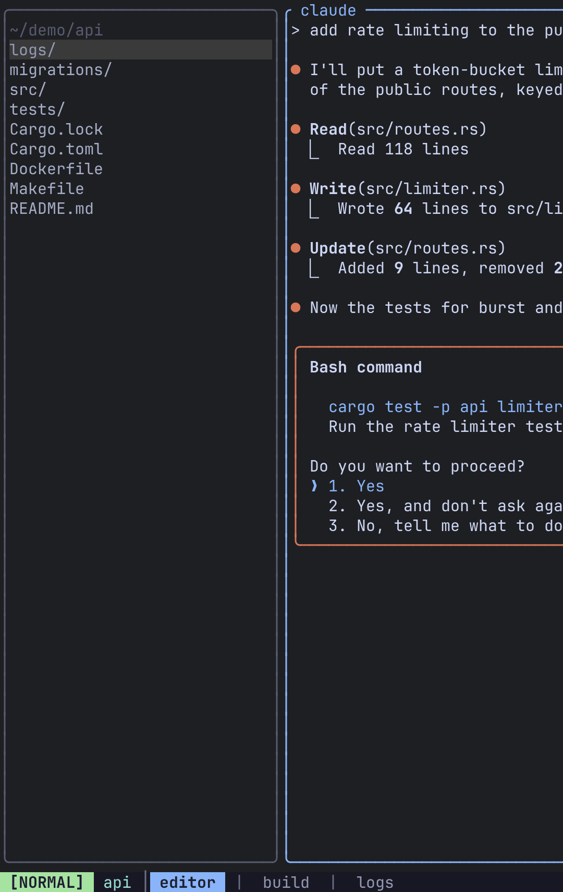

A sidebar is a strip of panels docked to one edge of your terminal. It is drawn by the client, not the server: it is not a pane, it belongs to no session, and the panes simply get whatever space is left once every visible sidebar has taken its slice.

There are no sidebars by default. Declare one in `config.toml` to opt in.



## Add a sidebar

Each `[[sidebar]]` table docks one sidebar to an edge, and each `[[sidebar.panel]]` under it stacks one plugin inside it, in the order written. A good starting point is the session tree above the file browser:

```toml
[[sidebar]]
edge = "left"
size = 30
visible = true

  [[sidebar.panel]]
  plugin = "sessions"
  weight = 1

  [[sidebar.panel]]
  plugin = "files"
  weight = 1
```

Add an `agents` panel on another edge to watch your AI agents:

```toml
[[sidebar]]
edge = "right"
size = 34

  [[sidebar.panel]]
  plugin = "agents"
```

Sidebar changes apply as soon as you save the config. No restart is needed.

:::note
Reloading the config rebuilds the panels, so a `sessions` tree loses its expansion and selection on any config edit.
:::

## Sidebar fields

| Field | Required | Default | Meaning |
|---|---|---|---|
| `edge` | yes | — | `"left"`, `"right"` or `"bottom"`. There is no `"top"`. An unknown edge is a config error. |
| `size` | yes | — | Thickness: columns for `left`/`right`, rows for `bottom`. This is the starting size; you can resize at runtime. |
| `visible` | no | `true` | Whether the sidebar starts open. Once you toggle or resize a sidebar, its saved state wins at startup (see [What is remembered](#what-is-remembered)). |

**One sidebar per edge.** All three edges can be used at once, but a second `[[sidebar]]` on an edge that is already taken is dropped with a warning in the log. To show two things on one edge, give that sidebar two panels.

Sizes are clamped so the panes keep at least 20 columns and 5 rows. A sidebar that cannot fit even when shrunk is hidden until the terminal is large enough again. The left and right sidebars own the corners; a bottom sidebar spans only the columns between them.

## Panel fields

| Field | Default | Meaning |
|---|---|---|
| `plugin` | — (required) | Which plugin to show: `sessions`, `agents`, `files` or `placeholder`. |
| `weight` | `1` | This panel's share of the sidebar relative to its siblings. Weights of 2 and 1 split the sidebar two thirds and one third. |
| `editor` | unset | `files` only: the editor to open files with, overriding the server's `$EDITOR`. Ignored by every other plugin. |

An unknown plugin name is skipped with a warning rather than rejected, so a config written for a newer Remux still loads. A sidebar with no usable panels is dropped entirely. Both tables are also in the [config reference](/remux/config-reference/#sidebar).

## Plugins

### sessions

A live tree of every session, tab and pane on the local server and every connected [remote](/remux/remotes/). It refreshes by itself whenever the tree changes.

| Key | Action |
|---|---|
| `j` / `k` (or arrows) | Move |
| `g` / `G` | Jump to the top / bottom |
| `l` / `h` (or Right / Left) | Expand / collapse the node |
| `Space` | Toggle the node |
| `Enter` | Jump to the selected session, tab or pane |

`l` and `h` always expand and collapse rather than toggling, so holding one down cannot flap a node open and shut.

:::note
In the [session manager](/remux/sessions/) overlay, `Space` marks panes for a View. In this panel it only opens and closes nodes.
:::



### agents

Every pane running an AI coding agent, on every connected server, colour-coded by what it is doing: red needs your input, yellow is working, dim is idle. `j`/`k`/`g`/`G` move and `Enter` jumps to that pane, wherever it is. See [Agents](/remux/agents/) for how detection works and how to configure it.



### files

A built-in file browser with nothing to install or configure.

| Key | Action |
|---|---|
| `j` / `k` (or arrows) | Move |
| `g` / `G` | Jump to the top / bottom |
| `l` (or Right) | Enter the selected directory |
| `h` (or Left) | Go up a level, landing on the directory you left |
| `.` | Show or hide hidden entries |
| `r` | Re-list now |
| `Enter` on a file | Open it in a split running an editor |

`Enter` on a file opens a new split running an editor, and the keyboard moves to that split with it. `l` never opens a file; only `Enter` does.

The editor is resolved **on the server that holds the file**: the panel's `editor` if you set one, else that server's `$EDITOR`, else `vi`. That matters for remotes, where your local `$EDITOR` may not exist.

```toml
[[sidebar.panel]]
plugin = "files"
editor = "hx"
```

The panel re-lists itself about every two seconds while it is on screen, so files created or deleted elsewhere appear and disappear without a keystroke, and the cursor stays on the entry it was on. A hidden sidebar polls nothing. Very large directories are capped at 5000 entries, and the panel says so. A directory it cannot read shows the reason instead of an empty list.



#### Which directory it shows

The panel follows the **focused pane's** directory, and it updates when **focus moves**, not when you `cd`. Typing `cd ~/project` in a pane does not move the panel; move focus away and back, or navigate the panel yourself with `h`/`l`. While you are somewhere you chose, the panel stops following focus.

It also follows the pane's machine. Focus a pane on a remote and the panel lists that remote's filesystem.

### placeholder

A test fixture that paints its own name and size. It exists for checking sidebar geometry; there is no reason to use it day to day.

## Move in and out

`Alt-h`/`Alt-j`/`Alt-k`/`Alt-l` move focus into and out of a sidebar exactly as they move between panes. There is nothing new to learn: from the leftmost pane, `Alt-h` enters a left sidebar.

The `b` group under the prefix manages sidebars:

| Keys | Action |
|---|---|
| `Ctrl-a b h` | Show or hide the left sidebar |
| `Ctrl-a b l` | Show or hide the right sidebar |
| `Ctrl-a b j` | Show or hide the bottom sidebar |
| `Ctrl-a b b` | Cycle focus through every visible panel, then back to the panes |

You can also click a row to select it.

:::tip
There are no default keys that jump straight into a sidebar, but the actions exist. Bind them under `[keybindings.command.b]` if you want them:

```toml
[keybindings.command.b]
H = "SidebarFocusLeft"
L = "SidebarFocusRight"
J = "SidebarFocusBottom"
```
:::

## Resize

While a panel has focus, the pane-resize keys (`Ctrl-a p R` then `h`/`j`/`k`/`l`) act on the sidebar instead:

- Across the edge (left/right for a side sidebar, up/down for the bottom one) resizes the **sidebar**.
- Along the edge adjusts the focused **panel's weight** against its siblings.

## What is remembered

Each sidebar's visibility and size, and each panel's weight, are saved to `$XDG_STATE_HOME/remux/sidebar.json` (by default `~/.local/state/remux/sidebar.json`) and restored the next time you start. At startup the saved state wins: the `size` and `visible` in your config are only the defaults for a sidebar with no saved state yet. While Remux is running, a value you change in the config takes effect when you save; values you did not touch keep what you last set at runtime.

## Frames

A sidebar is framed in the same `border_style` as the panes beside it: a rounded box around the whole sidebar under `zellij_style`, or a single divider on the side facing the panes under `tmux_style`. Stacked panels are separated by a rule. The frame is drawn inside the sidebar's `size`, and under `zellij_style` it takes the active border colour while one of its panels has focus. `Ctrl-a g` reframes sidebars along with the panes. See [Theme](/remux/theme/).

## Migrating from `browser`

Older configs may carry one of two stale lines from before the two file panels merged:

| Old | Now |
|---|---|
| `plugin = "browser"` | Still loads, with a warning. Rename it to `"files"`. |
| `command = "…"` | **Ignored**, with a warning. Delete it, or use `editor` if you meant to override the editor. |

## Related

- [Agents](/remux/agents/): configure what the `agents` panel detects.
- [Remotes](/remux/remotes/): browse and jump across machines.
- [Configuration](/remux/configuration/) and the [config reference](/remux/config-reference/).
