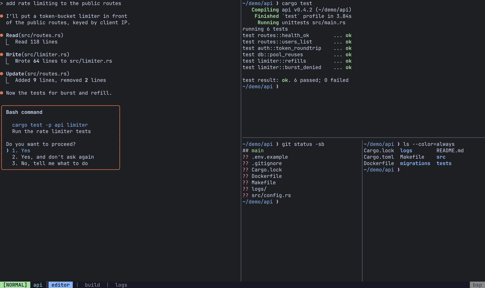
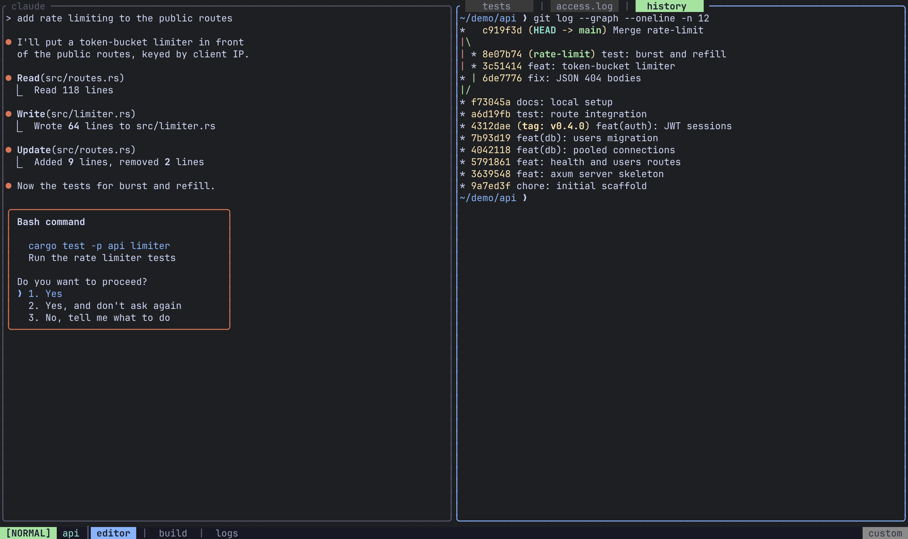
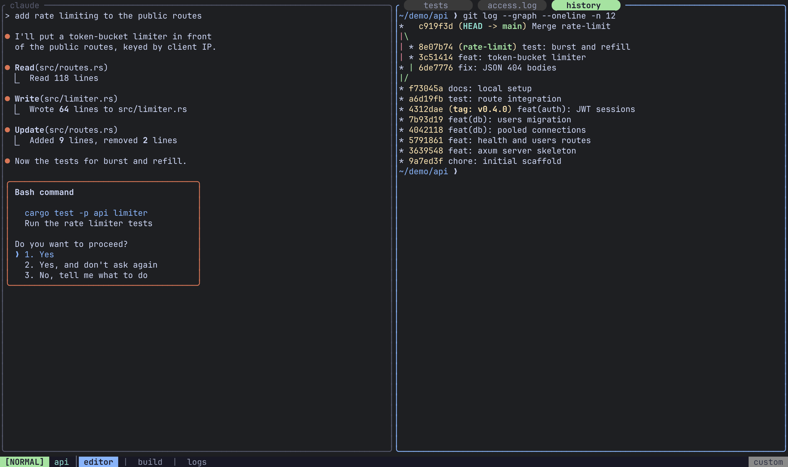
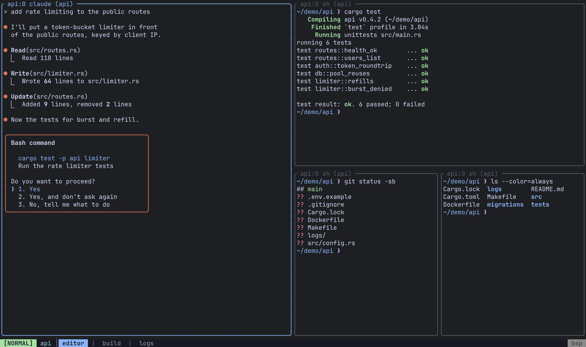
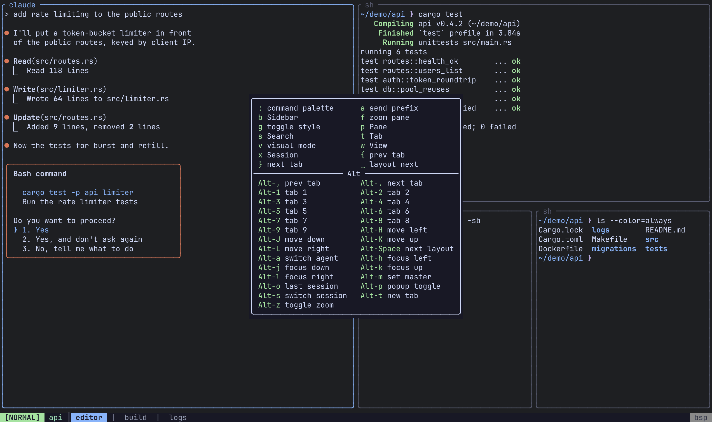
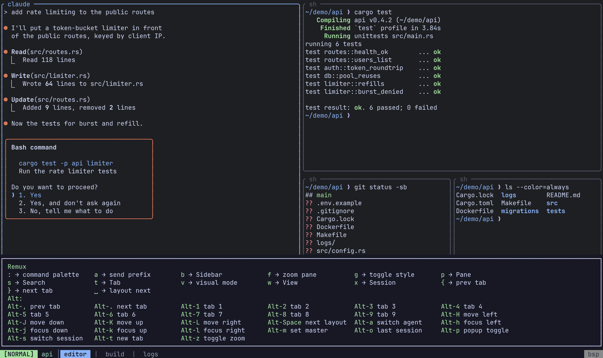
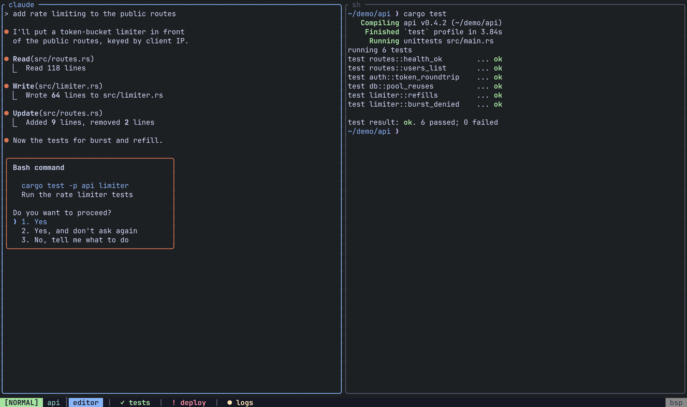

Everything about how Remux looks lives under `[appearance]` and its colour table, `[appearance.theme]`. The defaults are the Catppuccin Mocha palette.

## When changes apply

Some of what you see is drawn by the client and some by the server, and that decides whether an edit shows up on save:

| Applies when you save | Needs `remux restart` |
|---|---|
| `pane_title`, `tab_style`, `which_key_position` | `border_style`, `default_layout`, `popup_width_pct`, `popup_height_pct` |
| Colours of what the client draws: overlays, which-key, sidebars, Views, search highlights | Colours of what the server draws: pane borders, tab strips and the status bar in ordinary tabs |

`border_style`, `default_layout` and the popup size are applied when a session or tab is created, so after a restart they affect new sessions and tabs.

## Border style

```toml
[appearance]
border_style = "zellij_style"
```

| Value | Look |
|---|---|
| `"zellij_style"` (default) | A box around every pane with its name on the top border |
| `"tmux_style"` | Minimal dividers between panes, and a tab bar |

`Ctrl-a g` toggles the style of the current session at runtime. [Sidebars](/remux/sidebars/#frames) follow the same style.



## Tab style

`tab_style` puts end caps on the chips in a pane's tab strip: the tabs on a stacked pane's top border, the tmux-style tab bar, and the title strip of a Monocle View.

```toml
[appearance.theme]
tab_style = "rounded"
```

| Value | Caps |
|---|---|
| `"plain"` (default) | No caps; chips separated by ` \| ` |
| `"rounded"` | Powerline half circles (needs a Nerd Font) |
| `"slanted"` | Powerline slants (needs a Nerd Font) |
| `"square"` | Half blocks (any font) |

A strip too narrow for a capped chip falls back to plain. `tab_style` is a client setting: your client sends it to every server it views, local and remote, so one config styles tabs the same everywhere, and it applies on save.





## Pane titles

`pane_title` is a template that names every pane: on its border, in the Monocle strip, in the session tree, in View cells, and in the [agents](/remux/agents/) panel and switcher.

```toml
[appearance]
pane_title = "{session}:{tab} {command} ({cwd})"
```



| Placeholder | Renders |
|---|---|
| `{title}` | The window title the program set (OSC 0/2), once it has held for a second, with a leading spinner glyph removed. Empty when there is none, or when the program that set it is no longer in the foreground. |
| `{command}` | The foreground job's process (`claude`, `top`) once it has held the terminal for a second, else the shell (`zsh`). |
| `{session}` | The session's name. |
| `{tab}` | The tab's 0-based index in its session. |
| `{cwd}` | The last component of the pane's working directory. |
| `{host}` | The remote's name; empty for a local pane. |

How the template is resolved:

- Separator text left dangling by an empty placeholder is dropped when it is only whitespace and separators (`:` `-` `|` `·` `/` `,` `–` `—` `•`). So `"{command}: {title}"` on an untitled pane reads `zsh`, not `zsh:`.
- If the whole result is empty, the pane falls back to `{command}`.
- An unknown placeholder is shown literally, with a warning in the log. There is no brace escaping.
- A name you set with `PaneRename` always wins.

Unset (the default), a pane shows its title when it has one and its command otherwise.

Like `tab_style`, `pane_title` belongs to the client: it names panes on every server you view, remotes included, and applies on save.

## Which-key popup

```toml
[appearance]
which_key_position = "anchored"
```

| `which_key_position` | Placement |
|---|---|
| `"anchored"` (default) | A bordered box centred horizontally, anchored to the bottom |
| `"centered"` | The same box, centred both ways |
| `"full_width"` | A panel spanning the full width, just above the status bar |

The popup opens as soon as you press the prefix. `timeout_ms` under `[modes.command]` appears in the sample config but currently has no effect.





## Popup size

The floating popup terminal (`Alt-p`) is sized as a percentage of the session's content area, clamped to 20–100:

```toml
[appearance]
popup_width_pct = 80
popup_height_pct = 80
```

## Status bar position

:::caution
`status_bar_position` appears in the sample config, but it currently has no effect: the status bar is always drawn on the bottom row. Leave it at `"bottom"`.
:::

## Colours

Set colours under `[appearance.theme]`. Each value can be:

| Form | Example |
|---|---|
| A named colour | `"green"`, `"bright_blue"`, `"dark_grey"` |
| CSS hex (6 digits) | `"#cba6f7"` |
| An ANSI 256-colour index | `{ ansi = 237 }` |
| RGB | `{ rgb = [255, 128, 0] }` |

`"reset"`, like any name Remux does not recognise, means the terminal's default colour. The full list of names, and every role's default, is in the [config reference](/remux/config-reference/#appearancetheme).

```toml
[appearance.theme]
frame_active_fg = { ansi = 2 }
frame_bg = "#1e1e2e"
status_bar_bg = { rgb = [40, 40, 40] }
tab_style = "rounded"
session_name_fg = "#94e2d5"
```

### Colour roles

| Roles | What they colour |
|---|---|
| `mode_normal_fg/bg`, `mode_command_fg/bg`, `mode_visual_fg/bg`, `mode_search_fg/bg` | The mode indicator in the status bar, per mode |
| `mode_unknown_fg/bg` | The mode indicator for a mode with no colours of its own |
| `frame_fg`, `frame_active_fg` | Pane borders, unfocused and focused |
| `frame_bg` | Background of border cells. Unset by default, so borders sit on the terminal's background. |
| `status_bar_fg/bg` | The status bar |
| `session_name_fg` | The session name in the status bar |
| `separator_fg` | Separators in the status bar and tab strips, and the borders of overlays such as the session manager |
| `tab_active_fg/bg`, `tab_inactive_fg/bg` | Tab chips. `tab_inactive_bg` is the block behind an inactive tab in a pane's tab strip; inactive tabs in the status bar sit on `status_bar_bg`. |
| `tab_bell_fg`, `tab_activity_fg`, `tab_silent_fg` | Activity markers on inactive status-bar tabs: `!` for a bell, `●` for output, `✓` for a tab that has gone quiet. The [agents](/remux/agents/) list reuses the first two for "needs input" and "working". |
| `pane_label_fg/bg` | The pane name or stacked-tab title on a pane's top border. Unset by default, so the label takes the border's colour and follows focus. |
| `layout_indicator_fg/bg` | The layout name at the right of the status bar |
| `search_count_fg/bg` | The `(n/m)` search-match counter |
| `search_match_fg/bg`, `search_current_fg/bg` | Search highlights: every match, and the current one |
| `whichkey_fg`, `whichkey_bg`, `whichkey_key_fg` | The which-key popup and its key column |
| `sidebar_current_bg` | The agents panel's highlight for the pane you are in. Keep it distinct from `tab_active_bg`/`tab_inactive_bg`, which the panel uses for its selection. |




## Related

- [Configuration](/remux/configuration/): where the config file lives and how reloading works.
- [Config reference](/remux/config-reference/): every key in one place.
- [Layouts](/remux/layouts/): `default_layout` and the `[layouts]` section.
