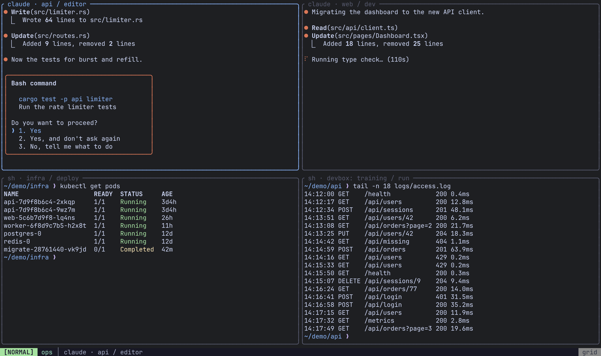
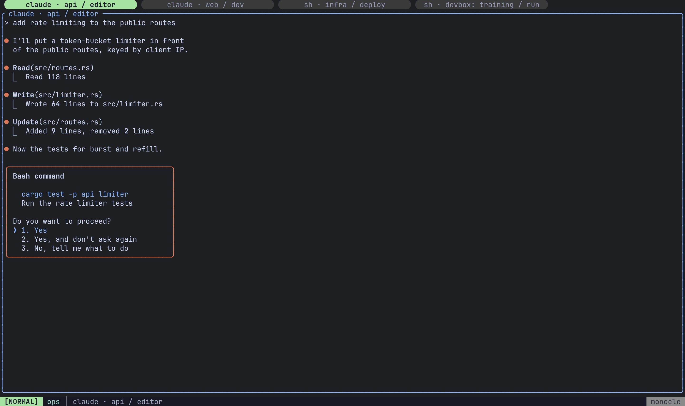

A **View** is a screen made of panes that already exist somewhere else: in other tabs, other sessions, or on other machines. Each cell is a live alias of the real pane. You see its output as it happens and what you type goes to it, while the pane itself stays where it is. Use a View to watch a build on one machine, a log tail on another and an agent in a third session, all at once, without moving any of them.

## Create a view

**From the session manager.** This is the quickest way to gather panes from several places.

1. Open the session manager with `Ctrl-a x m`.
2. Move to a pane and press `Space` to mark it. Mark as many as you like, across sessions, tabs and connected [remotes](/remux/remotes/).
3. Press `v` then `a`. The view picker opens.
4. Pick an existing view, or **New view** to create one.

With nothing marked, `va` adds the highlighted pane, or every pane of the highlighted tab.

**From the pane you're in.** `Ctrl-a w a` adds the focused pane to a view through the same picker.

A new view created from the picker is named `View 1`, `View 2` and so on, and opens straight away. Adding to an existing view doesn't switch to it. To create an empty view with a name of your choosing, press `Ctrl-a w n`.

## Enter and leave

| Action | Keys |
|---|---|
| Open a view | `Alt-s` or `Ctrl-a x s` (views are listed first in the switcher) |
| Leave the view; it stays available | `Ctrl-a w q` |

Views also appear under their own **Views** group in the session manager. `Enter` on a view opens it; `Enter` on one of its cells opens it with that cell focused.

## Work inside a view

A view takes over the keyboard while it's on screen. The familiar pane keys act on its **cells**:

| Action | Keys |
|---|---|
| Move focus between cells | `Alt-h` / `Alt-j` / `Alt-k` / `Alt-l` |
| Cycle the view's layout | `Alt-Space`, `Ctrl-a Space` or `Ctrl-a w Space` |
| Zoom the focused cell | `Alt-z`, `Ctrl-a f` or `Ctrl-a p z` |
| Move the focused cell | `Alt-H` / `Alt-J` / `Alt-K` / `Alt-L` |
| Resize the focused cell | `Ctrl-a p R` then `h` / `j` / `k` / `l` |
| Make the focused cell the master | `Alt-m` or `Ctrl-a p m` |
| Remove the focused cell from the view | `Ctrl-a w x` or `Ctrl-a p x` |

Everything else you type goes to the pane behind the focused cell.

:::caution
Removing a cell never closes the pane. `Ctrl-a p x`, which closes a pane in a normal tab, only takes the cell out of the view here. Other tab and pane commands, such as splitting or opening a tab, do nothing while a view is on screen.
:::

## Layouts in a view

A view uses the same layout engine as a tab (see [Layouts](/remux/layouts/)). It starts in **Grid**, or in the first enabled layout if `[layouts]` turns Grid off, and cycles through whichever automatic layouts are enabled. Moving or resizing a cell switches the view to `custom` until you next cycle.

In Monocle, a title strip along the top names every cell:

## A pane in two places

A pane can be on screen in its own session and in a view at the same time. While its own tab is showing in any attached terminal, the view's cell shows an **Active in session** placeholder instead of a copy, and the pane keeps its full size in its real tab. The cell comes back as soon as you leave that tab.

## Manage views

| Action | Keys |
|---|---|
| New view (prompts for a name) | `Ctrl-a w n` |
| Rename the current view | `Ctrl-a w r` |
| Delete the current view, for every terminal | `Ctrl-a w d` |

In the session manager, with a view or one of its cells highlighted:

| Action | Keys |
|---|---|
| Rename the view | `v` `r` |
| Remove the highlighted cell | `v` `x` |
| Delete the view | `v` `d`, or `d` then `y` to confirm |

## Shared, but not saved

Views live on your local Remux server, so every terminal attached to it sees the same views. Adding a cell, moving focus, changing the layout or zooming in one terminal shows up in all the others. Their cells can still point at panes on any connected remote.

:::note
Views are kept in memory only. They are gone after `remux stop` or `remux restart`, even when your sessions are restored.
:::

## Related

- [Sessions & persistence](/remux/sessions/): the session manager and the switcher
- [Remotes over SSH](/remux/remotes/): bring panes from other machines into a view
- [Layouts](/remux/layouts/)
